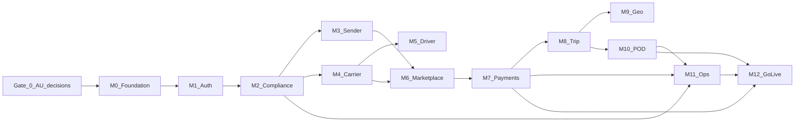

# Clox — Australia-Only Milestones (Phase 1)

**Scope:** Australia full-load freight marketplace only — no multi-country rollout in this plan.  
**Parent plan:** [MILESTONES.md](MILESTONES.md) (full detail, exit criteria, risks, FR traceability)  
**Build checklists:** [PHASE-1-IMPLEMENTATION-PLAN.md](PHASE-1-IMPLEMENTATION-PLAN.md)  
**Last updated:** 2026-06-04

---

## Summary

| Item | Count |
|------|-------|
| **Total program gates** | **13** |
| Pre-build decisions | **1** — Gate 0 |
| Delivery milestones | **12** — M0 through M12 |

Phase 1 in [BRD](BRD.md) and [PRD](PRD.md) is already **Australia-first**. These milestones do **not** change when you limit launch to Australia; you only avoid building cross-border / multi-currency features (deferred to Phase 2).

**Launch geography (still Australia):**

| Option | Meaning | Milestone count |
|--------|---------|-----------------|
| **State pilot** | e.g. Victoria only at go-live | Same 12 — smaller geofence and State/Local ops scope in M9, M11, M12 |
| **National AU** | All states/territories at go-live | Same 12 — full State Master RBAC from day one |

Record the choice in **Gate 0 (G0-5)** before M0 starts.

---

## Gate 0 — Australia decisions (before M0)

**Duration:** ~1–2 weeks  
**Purpose:** Lock AU-specific product and vendor choices so engineering does not rework M6–M12.

| ID | Decision | Australia default |
|----|----------|-------------------|
| G0-1 | Payment at launch | **Model A** — pay 100% on proposal accept (AUD via Stripe) |
| G0-2 | KYB/KYC | **Manual Ops review** — easyAML/Trulioo deferred |
| G0-3 | Carrier approval | Auto when clean; else Ops queue |
| G0-4 | Local BDE can approve compliance | View + escalate (not approve) unless policy changes |
| G0-5 | Pilot geography | **One AU state** (e.g. VIC) *or* **national Australia** |
| G0-6 | Payout rail for pilot | **Stripe Connect only** (Monoova optional later) |
| G0-7 | Mobile apps | Team choice (native / React Native / Flutter) |
| G0-8 | Tariffs & rules | Versioned DB tables; Super Admin edits (AUD) |

---

## The 12 Australia delivery milestones

### M0 — Foundation & engineering baseline

**Goal:** Runnable codebase and AU-ready infrastructure on stage.

- Modular monolith repo, CI/CD, dev/stage/prod
- PostgreSQL, object storage, queue
- API `/v1`, ERD v0, ADRs (Model A, module boundaries)
- Design tokens from [screen-flows](screen-flows/README.md)

**Australia-specific:** AUD as currency in data model; AU region for cloud/storage where applicable.

---

### M1 — Identity, auth & RBAC

**Goal:** All six roles authenticate; API enforces least privilege.

- OTP register/login, session rotation
- Roles: Super Admin, State Master, Local BDE, Sender, Transport Company, Driver
- Audit log for auth and admin actions

**Australia-specific:** Admin roles map to **AU states/territories** (State Master) and **local territories** (Local BDE).

---

### M2 — Compliance & document platform

**Goal:** Shared KYB/KYC and document pipeline for senders and carriers.

- Document upload, metadata, expiry watchdog
- Sender and carrier **state machines**
- Compliance review queue API for Ops

**Australia-specific:**

- Business: **ABN/ACN** + docs → **manual Ops** verification (no easyAML Phase 1)  
- Individual: government **ID upload** → **manual Ops** KYC  
- Carrier: **public liability**, **cargo insurance**, **RWC**, permits (e.g. DG) → **manual Ops** unlock  
- No non-AU document types in Phase 1  

---

### M3 — Sender onboarding (Web)

**Goal:** Senders reach `sender_active` and can book.

- Web flows `SND-ONB-01` … `05`
- Business vs individual path
- Invoice profile: legal name, **AU address**, **GST** flags
- Stripe Customer + default payment method

**Refs:** [useronboarding](useronboarding.md) · [sender screen flows](screen-flows/sender.md)

---

### M4 — Transport company onboarding (Web)

**Goal:** Carriers reach `approved_bid_eligible`.

- 8-step wizard `TCO-ONB-01` … `08`
- KYB, mandatory AU compliance uploads
- **Stripe Connect** payout onboarding
- Minimum fleet + driver; auto-approve or Ops review
- Suspension on expired insurance/RWC

**Refs:** [transportcompanyonboarding](transportcompanyonboarding.md) · [transport-company screen flows](screen-flows/transport-company.md)

---

### M5 — Driver onboarding (Web invite)

**Goal:** Carrier-invited drivers reach `driver_active`.

- Invite link, OTP, password
- Licence class, number, expiry
- **NHVR** / safety policy acknowledgement (per legal copy)
- Linked to one primary transport company

**Refs:** [useronboarding §2](useronboarding.md) · [driver screen flows](screen-flows/driver.md)

---

### M6 — Jobs, matching & marketplace

**Goal:** Sender publishes jobs; eligible AU carriers bid (payment in M7).

- Job wizard: pickup/drop, load, site suitability, vehicle class
- **Chargeable weight:** max(dead, volumetric) per [BRD](BRD.md)
- **Hourly local:** up to 4 pickups · **Per-km:** single pickup + single drop
- Rules-based vehicle recommendation (no oversize class below minimum)
- Broadcast, proposals, overlap bid expiry logic

**Australia-specific:** Google Maps/Routes for AU addresses; DG rules per AU carrier accreditation.

---

### M7 — Payments & assignment lock (Model A)

**Goal:** Accept proposal → full **AUD** fare captured → assignment locked.

- Stripe PaymentIntent on accept (100% upfront per BRD)
- Webhooks, idempotent payment states
- Assignment lock + conflicting bids expired
- Sender UX: pending / failed / 3DS

**Australia-specific:** Stripe Connect AU; no Model B (deposit at publish) in Phase 1 unless explicitly added later.

---

### M8 — Trip execution (mobile)

**Goal:** Driver completes pre-trip gates; sender tracks after trip start.

- **Driver app:** safety checklist → mass check → **Start trip** (server-gated)
- **Sender app:** home, map/timeline after `in_transit`
- Trip state machine authoritative on server

**Australia-specific:** Fatigue = manual work diary in Phase 1; optional “Taking break” for ETA only.

---

### M9 — Geofencing, dwell & surcharges

**Goal:** AU pickup/drop events drive wait timers and extra charges.

- Radar (or equivalent) geofence ingest, anti-bounce
- Free waiting window then **overage charge**
- Mass over declared → surcharge; block start until sender pays
- Sender approvals inbox (mobile + web)

**Australia-specific:** Geofences around AU pickup/drop coordinates; pilot may limit to one state polygon set.

---

### M10 — POD, breakdown & invoicing

**Goal:** Trip completes with legal-grade evidence.

- Sign-on-glass + photos + server timestamp + GPS metadata
- Trip `completed`; tax invoice payload generated
- Breakdown report → carrier / ops visibility
- Reassignment money paths per policy (stub or full per launch bar)

---

### M11 — Ops portal (Australia admin tiers)

**Goal:** Internal teams govern the AU marketplace.

| Tier | Scope | Key flows |
|------|--------|-----------|
| **Super Admin** | National | Policy/tariffs, all-region compliance, disputes, settlements view, provision State/Local admins |
| **State Master** | One AU state/territory | State compliance queue, disputes, Local BDE team |
| **Local BDE** | Local territory | Growth pipeline, first-line disputes, local revenue snapshot |

**Australia-specific:** Revenue split labels — Super **15%**, State **10%**, Local **5%** of gross platform share ([BRD](BRD.md)). Fortnightly settlement cycle (“4th night” operating phrase).

**Refs:** [super-admin](screen-flows/super-admin.md) · [state-master-admin](screen-flows/state-master-admin.md) · [local-bde-admin](screen-flows/local-bde-admin.md)

---

### M12 — Settlement, reconciliation & Australia pilot go-live

**Goal:** Money reconciles; pilot runs with KPIs.

- Settlement scheduler (carrier ~70% net, admin accruals)
- Stripe vs DB reconciliation cron
- Notifications for payment/trip events
- Security Phase 1 checklist
- **Pilot:** ≥3 AU carriers, ≥10 completed trips with POD in chosen geography

**Pilot options (both Australia-only):**

- **State pilot:** e.g. VIC — faster compliance and support load  
- **National pilot:** all states — higher ops and RBAC testing burden  

---

## Milestone dependency order

---

## In scope vs out of scope (Australia Phase 1)

### In scope (these 12 milestones)

- AU FLT/FTL marketplace (one sender, one vehicle, one job)
- OTP onboarding; ABN/ACN KYB; individual KYC
- Carrier compliance gate before bidding
- Job create, bid, accept, pay (Model A, AUD)
- Trip gates, geofence dwell, mass surcharge, POD
- Three-tier AU ops portal and fortnightly settlement concept
- Stripe Connect for collection; pilot without Monoova unless added in G0-6

### Out of scope (not counted as milestones here)

| Item | When |
|------|------|
| Cross-border / international lanes | Phase 2+ |
| Multi-currency | Phase 2+ |
| Non-AU regulatory packs (e.g. EU/US) | Phase 2+ |
| Payment Model B (deposit at publish) | Phase 2 or post-pilot |
| Monoova NPP/Osko at scale | Phase 2 optional |
| AFM / EWD fatigue automation | Phase 2 |
| Fleet+ profit engine & advanced AI dispatch | Phase 2 |

---

## FR coverage (Australia Phase 1)

| FR | Milestone |
|----|-----------|
| FR-1 Onboarding & verification | M2, M3, M4, M5 |
| FR-2 Job creation | M6 |
| FR-3 Vehicle recommendation | M6 |
| FR-4 Bidding & award | M6, M7 |
| FR-5 Trip execution | M8, M9 |
| FR-6 Geofencing & dwell | M9 |
| FR-7 Discrepancy & breakdown | M9, M10 |
| FR-8 POD & invoicing | M10 |

---

## Release trains (Australia)

| Train | Milestones | What you can demo |
|-------|------------|-------------------|
| Alpha 1 — Trust | M0–M2 | AU login, upload compliance docs, state changes |
| Alpha 2 — Supply | M3–M5 | AU sender, carrier, driver onboarded |
| Beta 1 — Marketplace | M6–M7 | Post job, bid, pay in AUD, assign |
| Beta 2 — Move freight | M8–M10 | Full AU trip with POD |
| RC / Pilot | M11–M12 | Ops governance + settlement + live pilot |

---

## Quick reference — all 13 names

| # | ID | Name |
|---|-----|------|
| — | **Gate 0** | Australia decisions (before build) |
| 1 | **M0** | Foundation |
| 2 | **M1** | Identity & RBAC |
| 3 | **M2** | Compliance & documents |
| 4 | **M3** | Sender onboarding (web) |
| 5 | **M4** | Transport company onboarding (web) |
| 6 | **M5** | Driver onboarding (web invite) |
| 7 | **M6** | Jobs & marketplace |
| 8 | **M7** | Payments & assignment (Model A) |
| 9 | **M8** | Trip execution (mobile) |
| 10 | **M9** | Geofencing, dwell & surcharges |
| 11 | **M10** | POD, breakdown & invoicing |
| 12 | **M11** | Ops portal (Super / State / Local BDE) |
| 13 | **M12** | Settlement & Australia pilot go-live |

**Count:** **Gate 0** + **M0–M12** = **13** program gates · **M0–M12** = **12** build milestones.

---

## Related documentation

- [MILESTONES.md](MILESTONES.md) — Full program plan (exit criteria, risks, screen checklist)
- [BRD.md](BRD.md) — Australia business rules & revenue
- [PRD.md](PRD.md) — Functional requirements
- [screen-flows/README.md](screen-flows/README.md) — Role UI flows
