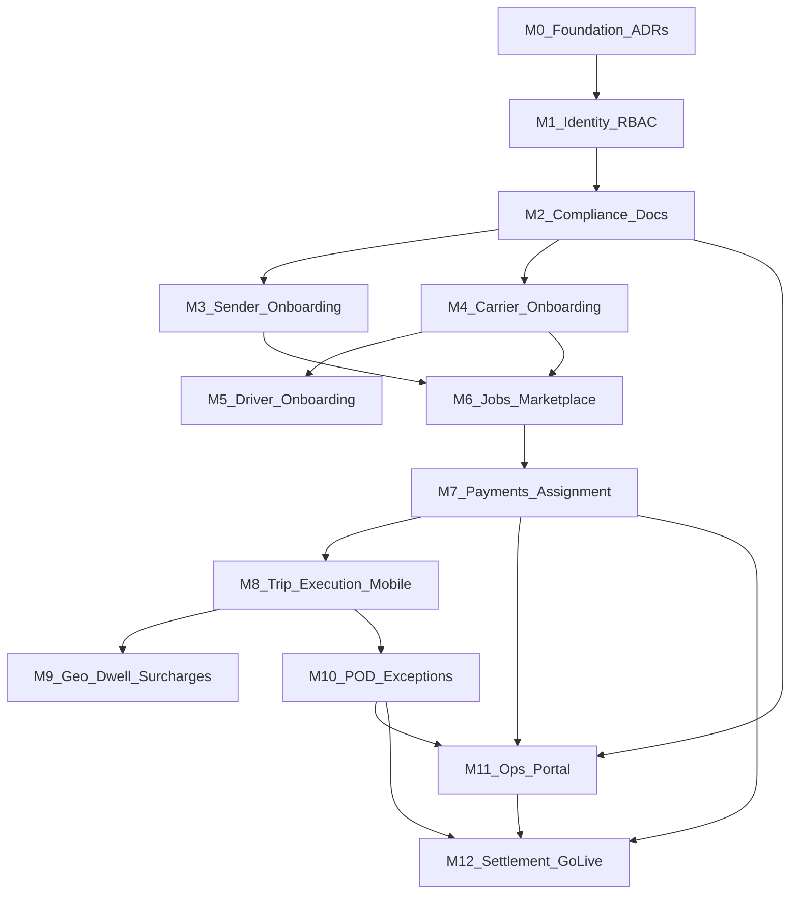

# Clox — Program Milestones (Phase 1)

**Owner:** TPM / Engineering leadership  
**Last updated:** 2026-06-04  
**Status:** Planning — repo is **docs-only** today (no application code in tree)

**Source of truth:** [PRD](PRD.md) · [BRD](BRD.md) · [system-design](system-design.md) · [screen-flows](screen-flows/README.md) · onboarding & integration specs

**Detailed implementation (what / how / checklists per milestone):** [PHASE-1-IMPLEMENTATION-PLAN.md](PHASE-1-IMPLEMENTATION-PLAN.md)  
**Gate 0 ADR (locked 2026-09-15):** [adr/G0-gate-0-phase1-decisions.md](adr/G0-gate-0-phase1-decisions.md)  
**Australia-only summary (13 gates, M0–M12 list):** [MILESTONES-AUSTRALIA.md](MILESTONES-AUSTRALIA.md)

---

## 1. Executive assessment

### What exists today

| Area | Maturity | Notes |
|------|----------|--------|
| Business & product requirements | **Strong** | BRD/PRD aligned; revenue model, compliance, and trip gates defined |
| Technical architecture | **Strong (overview)** | Modular monolith, bounded contexts, E2E sequences; schema/API deep-dives marked TODO |
| UX / screen flows | **Strong** | Six roles, screen IDs, gated UI rules, ~35 flows across web + mobile |
| Implementation | **None** | Zero app/backend/mobile code; single doc commit |
| Third-party contracts | **Specified** | Stripe, KYB/KYC, Radar, Maps — integration patterns documented |
| Go-live readiness | **Not started** | Security baseline listed; no SLO dashboards, runbooks, or pilot criteria wired |

### Product in one sentence

Australia-first **full-load freight marketplace**: senders publish jobs → compliant carriers bid → sender pays and accepts → driver executes gated trip (safety → geo → mass → transit → POD) → platform settles with auditable money and evidence trails.

### Phase 1 scope boundary (from PRD/BRD)

**In:** OTP onboarding, job/bid/assign, trip state machine, geofence dwell, discrepancy/breakdown money paths, digital POD, ops compliance.  
**Out:** AFM automation, Fleet+ profit engine, cross-border regulation, authoritative AI overrides on safety gates.

### Recommended delivery model

- **Vertical slices** after platform foundation — each slice is demoable end-to-end with test accounts.
- **Model A payments first** (pay on accept, no deposit at publish) — lower complexity per [system-design §2.1b](system-design.md); Model B is a follow-on milestone.
- **Web-first onboarding** for all customer roles; mobile = Sender track/approve + Driver execution only ([useronboarding](useronboarding.md)).

---

## 2. Critical path (dependency view)

**Longest pole:** M0 → M1 → M2 → M4 (carrier + compliance) → M6 → M7 → M8 → M10 → M12.

---

## 3. Gate 0 — Decisions before M0 (LOCKED)

**Canonical ADR:** [adr/G0-gate-0-phase1-decisions.md](adr/G0-gate-0-phase1-decisions.md) · **Accepted:** 2026-09-15  
**M0 status:** Unblocked

| # | Decision | Locked choice | Impacts |
|---|----------|---------------|---------|
| G0-1 | Payment model | **Model A** | M7, M12 |
| G0-2 | KYB/KYC | **Manual Ops** (no easyAML) | M2–M4 |
| G0-3 | Carrier unlock | **Always manual** (State/Super) | M4, M11 |
| G0-4 | Local BDE approve | **View + escalate** | M11 |
| G0-5 | Pilot geography | **VIC first** | M9, M11, M12 |
| G0-6 | Payout rail | **Stripe Connect only** | M12 |
| G0-7 | Mobile | **Flutter** (external team) | M8+ |
| G0-8 | Tariffs | Versioned DB tables | M6, M11 |
| G0-9–G0-18 | See ADR | Vite app, SCT Stripe, GST, vehicle floor, etc. | — |

---

## 4. Milestone catalog

Duration bands are **indicative** for a small cross-functional squad (2–3 backend, 2 mobile/web, 1 QA, 0.5 TPM). Adjust for team size and vendor lead times.

---

### M0 — Foundation & engineering baseline

**Target:** 2–3 weeks  
**Goal:** Runnable monorepo, environments, and architecture locked for Phase 1.

| Workstream | Deliverables |
|------------|--------------|
| Repo | Modular monolith skeleton; packages per bounded context in [system-design §1.2](system-design.md) |
| Infra | Dev/stage/prod; PostgreSQL; object storage; queue; secrets vault |
| CI/CD | Lint, test, build, deploy to stage; migration pipeline |
| API | Versioned REST (`/v1`), OpenAPI stub, correlation IDs |
| ADRs | Payment Model A; module boundaries; event/outbox pattern |
| Design | UI tokens from [screen-flows README](screen-flows/README.md) (CTA, cards, nav) |
| Data | ERD v0: User, Company, Vehicle, Driver, Job, Proposal, Assignment, Trip, ComplianceDocument, PaymentEvent |

**Exit criteria**

- [ ] `main` deploys hello-world API + health to stage
- [ ] ADRs signed for G0-1 … G0-8
- [ ] ERD reviewed by backend + finance (payment states)

**Maps to:** Engineering readiness (not a PRD FR)

---

### M1 — Identity, auth & RBAC

**Target:** 3–4 weeks (can overlap late M0)  
**Goal:** All six roles can authenticate; API enforces least privilege.

| Deliverables | Screen / doc refs |
|--------------|-------------------|
| OTP register/login, refresh rotation, session revoke | `SHR-AUTH-01/02`, [security](security.md) |
| RBAC: Super, State, Local BDE, Sender, Carrier, Driver | [screen-flows matrix](screen-flows/README.md) |
| Admin provisioning API (Super creates State/Local) | `OPS-SUP-ADM` (backend only; UI in M11) |
| Audit log: auth, role changes, sensitive reads | [security](security.md) §Operational |

**Exit criteria**

- [ ] Role matrix integration tests — deny cross-role endpoints
- [ ] FR-1 partial: OTP registration for all user types
- [ ] No booking/bid/trip APIs exposed without auth

**Maps to:** FR-1 (partial), NFR security (identity)

---

### M2 — Compliance & document platform

**Target:** 4–5 weeks  
**Goal:** Reusable compliance layer for sender, carrier, and document expiry.

| Deliverables | Screen / doc refs |
|--------------|-------------------|
| Document upload (signed URLs, scan hook, metadata + hash) | TCO-ONB-03, SND-ONB-03 |
| KYB/KYC provider adapter + webhooks | [thirdparty-integration](thirdparty-integration.md) §2 |
| State machines: sender, carrier (persisted, API-driven) | [useronboarding](useronboarding.md), [transportcompanyonboarding](transportcompanyonboarding.md) |
| Expiry watchdog job → `suspended_*` transitions | TCO-DOC-01, BRD compliance |
| Compliance review queue API (filter by region/type) | OPS-SUP-CMP, OPS-STA-CMP |

**Exit criteria**

- [ ] Carrier cannot reach `approved_bid_eligible` without mandatory docs + KYB
- [ ] Sender cannot reach `sender_active` without verification + payment setup stub
- [ ] FR-1 complete: compliance gate before bid eligibility (carrier side)

**Maps to:** FR-1, Data: ComplianceDocument

---

### M3 — Sender onboarding (Web)

**Target:** 3 weeks (after M2)  
**Goal:** Business and individual senders reach `sender_active` on web.

| Deliverables | Screen refs |
|--------------|-------------|
| Full FLOW 01: Welcome → OTP → KYB/KYC → invoice → Stripe customer | `SND-ONB-01` … `05` |
| Manual review queue handoff | `sender_pending_review` |
| Payment method capture (Stripe Customer) | SND-ONB-05 |

**Exit criteria**

- [ ] E2E test: new sender → active → gated booking flag true
- [ ] Go/no-go table in [useronboarding §1](useronboarding.md) passes in automation

**Maps to:** FR-1 (sender branch)

---

### M4 — Transport company onboarding (Web)

**Target:** 4–5 weeks (parallel with M3 after M2)  
**Goal:** Carrier completes 8-step wizard and becomes bid-eligible.

| Deliverables | Screen refs |
|--------------|-------------|
| 8-step onboarding wizard | `TCO-ONB-01` … `08` |
| Stripe Connect onboarding | [thirdparty-integration](thirdparty-integration.md) §1 |
| Fleet + driver invite minimum | `TCO-FLT`, `TCO-DRV` |
| Auto-approve path + Ops queue | [transportcompanyonboarding-sequence](transportcompanyonboarding-sequence.md) |
| Suspension on doc expiry | FLOW 05 TCO |

**Exit criteria**

- [ ] E2E: register carrier → upload docs → Connect → fleet → `approved_bid_eligible`
- [ ] Non-compliant carrier receives 403 on bid APIs
- [ ] FR-1 carrier compliance gate satisfied

**Maps to:** FR-1 (carrier), FR-4 prerequisite

---

### M5 — Driver onboarding (Web invite)

**Target:** 2 weeks (after M4)  
**Goal:** Carrier-invited driver reaches `driver_active`.

| Deliverables | Screen refs |
|--------------|-------------|
| Invite link + OTP + password | `DRV-WEB-01` … `05` |
| Licence capture + policy acknowledgement | NHVR copy per legal |
| Company linkage (single primary carrier) | [useronboarding §2](useronboarding.md) |

**Exit criteria**

- [ ] Driver assignable on proposal when licence class matches vehicle rules
- [ ] App login works but trip APIs return “not assigned” until M8

**Maps to:** FR-1 (driver), FR-4 (driver ref on bid)

---

### M6 — Jobs, matching & marketplace (pre-payment)

**Target:** 5–6 weeks  
**Goal:** Sender publishes job; eligible carriers bid; no money movement yet (or dry-run).

| Deliverables | Screen refs |
|--------------|-------------|
| Job wizard: lane, load, site suitability, vehicle class | `SND-JOB-01` … `05` |
| Chargeable weight = max(dead, volumetric) | [BRD](BRD.md) |
| Vehicle recommendation engine (rules only) | FR-3, [ai-integration](ai-integration.md) Phase 1 |
| Hourly (≤4 pickups) vs per-km routing via Maps | [thirdparty-integration](thirdparty-integration.md) §4 |
| Job broadcast + proposal CRUD | `TCO-MKT`, `TCO-BID` |
| Overlap-based bid expiry on award (logic only) | FR-4, system-design §2.2 step 3 |

**Exit criteria**

- [ ] Undersized vehicle class disabled in UI and API
- [ ] DG job requires carrier capability flag
- [ ] Sender sees proposals; accept API returns “payment required” stub until M7
- [ ] FR-2, FR-3, FR-4 (except payment lock) demonstrated in stage

**Maps to:** FR-2, FR-3, FR-4 (partial)

---

### M7 — Payments & assignment lock (Model A)

**Target:** 4–5 weeks  
**Goal:** Accept proposal → full fare captured → `paid_and_confirmed` → assignment locked.

| Deliverables | Screen refs |
|--------------|-------------|
| `POST accept` → PaymentIntent full fare | `SND-PRP-02/03`, system-design §2.2 |
| Stripe webhooks (idempotent), payment state machine | §2.8 consistency rules |
| Conflict expiry for same vehicle/driver | TCO-BID-02 “Expired (conflict)” |
| Sender payment UX: pending / failed / SCA | SND-PRP payment states |
| Carrier assignment view | `TCO-ASN` |

**Exit criteria**

- [ ] Happy path: accept → charge succeeded → assignment active
- [ ] Trip start API remains blocked until M8 gates + paid state
- [ ] Failed payment leaves assignment in `payment_failed` per §2.9
- [ ] FR-4 complete; BRD “sender pays 100% upfront” for awarded job

**Maps to:** FR-4, BRD payment rules, NFR payment security

---

### M8 — Trip execution — Driver mobile MVP

**Target:** 5–6 weeks  
**Goal:** Driver runs safety → mass → start trip; sender sees tracking after start.

| Deliverables | Screen refs |
|--------------|-------------|
| Driver app: Today, trip overview, pre-trip gates | `DRV-MOB-01` … `06` |
| Trip state machine (server authoritative) | system-design §2.7 |
| Start trip server gate: paid + safety + mass OK | FR-5 |
| Sender mobile: home + track map/timeline | `SND-MOB-01/02` |
| Push notifications (assignment, trip started) | SHR-NOTIF |

**Exit criteria**

- [ ] E2E: paid assignment → safety → mass OK → start → sender map live
- [ ] Client cannot start trip without server 200 (no trust local flags)
- [ ] FR-5 partial (no geo/dwell/POD yet)

**Maps to:** FR-5 (core), PRD tracking rule

---

### M9 — Geofencing, dwell & financial adjustments

**Target:** 4 weeks  
**Goal:** Arrival/dwell automated; waiting and mass surcharge flows bill sender.

| Deliverables | Screen refs |
|--------------|-------------|
| Radar webhook ingest + anti-bounce | [thirdparty-integration](thirdparty-integration.md) §3 |
| Wait timer + free window + overage charge | FR-6 |
| Mass discrepancy → incremental charge / block start | `DRV-MOB` surcharge block, `SND-SRG` |
| Sender approvals inbox (mobile + web) | FLOW 05 sender |
| Carrier read-only exception visibility | `TCO-ASN-02` |

**Exit criteria**

- [ ] Overage waiting produces deterministic `PaymentEvent` state
- [ ] Mass mismatch blocks start until surcharge paid or dispute opened
- [ ] FR-6, FR-7 (discrepancy path) satisfied

**Maps to:** FR-6, FR-7 (discrepancy), FR-5 (mass gate)

---

### M10 — POD, breakdown & invoicing artifacts

**Target:** 3–4 weeks  
**Goal:** Trip completes with immutable POD; breakdown path ops-visible.

| Deliverables | Screen refs |
|--------------|-------------|
| POD: SOG + photos + server timestamp + GPS | `DRV-MOB-08/09`, FR-8 |
| Trip → `completed`; invoice payload generation | FR-8 |
| Breakdown report + carrier notification | `DRV-MOB-10`, FR-7 |
| Reassignment / cancel financial hooks (policy stub) | system-design §2.9 |

**Exit criteria**

- [ ] POD metadata immutable; tamper-evident storage
- [ ] E2E job lifecycle from publish → POD → completed in stage
- [ ] FR-7 (breakdown reporting), FR-8 complete

**Maps to:** FR-7, FR-8

---

### M11 — Ops portal (three admin tiers)

**Target:** 5–6 weeks (start UI after M2 API; finish after M7/M10)  
**Goal:** Super / State / Local BDE can govern compliance, disputes, policy.

| Deliverables | Screen refs |
|--------------|-------------|
| Super: national dashboard, compliance, disputes, policy publish, admin provision, settlements view | `OPS-SUP` flows 01–07 |
| State: regional filter, compliance, dispute escalate/resolve, Local team | `OPS-STA` flows 01–05 |
| Local BDE: territory dashboard, growth pipeline, first-line disputes, revenue snapshot | `OPS-LOC` flows 01–05 |
| RBAC scoping: State ≠ other states; Local ≠ national policy | [screen-flows README](screen-flows/README.md) admin table |
| Tariff / policy versioning (Super only) | `OPS-SUP-POL` |

**Exit criteria**

- [ ] State admin cannot edit national tariffs
- [ ] Compliance approve changes carrier/sender state with audit row
- [ ] Dispute ticket flows Super → State → Local per escalation rules
- [ ] Revenue views show correct split labels (15/10/5) — accrual not payout yet

**Maps to:** Roles in PRD; BRD revenue; stakeholder sign-off areas

---

### M12 — Settlement, reconciliation & pilot go-live

**Target:** 4–5 weeks  
**Goal:** Fortnightly settlement cycle, ops runbooks, pilot KPIs.

| Deliverables | Screen refs |
|--------------|-------------|
| Settlement scheduler (carrier net ~70%, admin share accrual) | `OPS-SUP-FIN`, BRD §Revenue |
| Stripe reconciliation cron vs DB | system-design §2.9 webhook delay |
| Notification fan-out (email/push) for key money states | SHR-NOTIF |
| Security Phase 1 checklist | [security](security.md) Phase 1 |
| Observability: SLO dashboards, alerting on payment anomalies | NFR 99.9% |
| Pilot playbook: support, dispute SLA, legal copy | BRD Success Metrics |

**Exit criteria**

- [ ] **Pilot launch:** 1 geography, ≥3 carriers, ≥10 completed trips with POD
- [ ] BRD success metrics instrumented (booking-to-award, completion, dispute rate)
- [ ] All Phase 1 acceptance criteria in [PRD](PRD.md) verified
- [ ] Runbook for payment failure, webhook delay, compliance suspension

**Maps to:** BRD settlement, PRD acceptance criteria, NFRs

---

## 5. FR → milestone traceability

| FR | Requirement | Milestone |
|----|-------------|-----------|
| FR-1 | Onboarding & verification | M2, M3, M4, M5 |
| FR-2 | Job creation | M6 |
| FR-3 | Vehicle recommendation | M6 |
| FR-4 | Bidding & award | M6 (bid), M7 (award+pay) |
| FR-5 | Trip execution state machine | M8, M9 |
| FR-6 | Geofencing & dwell | M9 |
| FR-7 | Discrepancy & breakdown | M9, M10 |
| FR-8 | POD & invoicing | M10 |

---

## 6. Screen-flow coverage checklist

Use during UI sprint planning; each row should map to a shipped epic before pilot.

| Role | Flows (count) | Milestone |
|------|---------------|-----------|
| Shared auth/notif/profile | 3 | M1, M12 |
| Sender web | 3 (onb, job, proposals) | M3, M6, M7 |
| Sender mobile | 3 (track, approvals, account) | M8, M9 |
| Transport Co. | 5 | M4, M6, M7, M9, M10 |
| Driver web + mobile | 7 | M5, M8, M9, M10 |
| Super Admin | 7 | M11 |
| State Master | 5 | M11 |
| Local BDE | 5 | M11 |

---

## 7. Phase 2 backlog (post-pilot)

Not scheduled in milestones above; from PRD/BRD/ai-integration:

- Payment **Model B** (deposit on publish + balance on accept)
- Monoova payout rail at scale
- Fleet+ analytics & profit engine
- ML dispatch ranking beyond rules
- AFM / EWD fatigue integration
- In-app lite sender onboarding
- Twilio Proxy masking (optional)
- Advanced fraud / anomaly ML

---

## 8. Program risks & mitigations

| Risk | Likelihood | Impact | Mitigation | Milestone |
|------|------------|--------|------------|-----------|
| Payment model indecision (A vs B) | Medium | High slip on M7 | Gate 0 ADR; ship A first | G0, M7 |
| KYB vendor latency / false positives | Medium | Onboarding funnel drop | Manual review queue + SLA | M2, M11 |
| Stripe Connect onboarding friction (carriers) | High | Supply shortage at launch | Concierge onboarding, Local BDE assist | M4, M11 |
| Geofence GPS drift in industrial sites | Medium | Wrong dwell charges | Radar anti-bounce + manual override policy | M9 |
| Mobile offline “start trip” | Medium | Revenue / safety | Online-only start trip (system-design §2.9) | M8 |
| Three-tier admin RBAC bugs | Medium | Compliance breach | Integration tests per role matrix | M1, M11 |
| Scope creep (Model B + Monoova in pilot) | High | Miss pilot date | Explicit Phase 2 backlog (§7) | G0 |

---

## 9. Suggested release trains

| Train | Milestones | Demo narrative |
|-------|------------|----------------|
| **Alpha 1 — “Trust”** | M0–M2 | Login, upload docs, state transitions |
| **Alpha 2 — “Supply”** | M3–M5 | Sender + carrier + driver onboarded |
| **Beta 1 — “Marketplace”** | M6–M7 | Publish job, bid, pay, assign |
| **Beta 2 — “Move freight”** | M8–M10 | Full trip with POD in pilot geo |
| **RC / Pilot** | M11–M12 | Ops governance + settlements + KPIs |

---

## 10. Open documentation gaps (track as spikes)

These are called out in docs but block detailed estimation:

| Gap | Owner | Unblocks |
|-----|-------|----------|
| Relational schema deep-dive (system-design §3-C TODO) | Backend | M0 ERD → migrations |
| REST API conventions catalog (§3-D TODO) | Backend | M1 contract |
| Model B refund/expiry policy in BRD | Product/Finance | Phase 2 only if deferred |
| Exact tariff tables & DG surcharge rules | Product + Super policy UI | M6 pricing |
| Pilot SLA numbers for NFR “acceptable bands” | TPM + Eng | M12 SLOs |

---

## 11. Definition of Done (program level)

Phase 1 is **done** when:

1. All **PRD acceptance criteria** pass in production-like stage with recorded test evidence.
2. **Pilot KPIs** ([BRD §Success Metrics](BRD.md)) measured for 30 days.
3. **Security Phase 1** checklist complete with external review where required.
4. **Screen-flow index** (§6) implemented or explicitly waived with product sign-off.
5. **Finance** signs off on one full settlement cycle (fortnightly) with reconciliation report.

---

## Related links

- [PHASE-1-IMPLEMENTATION-PLAN.md](PHASE-1-IMPLEMENTATION-PLAN.md) — **Canonical** what/how/checklists for Gate 0 + M0–M12
- [PRE-LAUNCH-IMPLEMENTATION-PLAN.md](PRE-LAUNCH-IMPLEMENTATION-PLAN.md) — Phase 0 leads / Super console
- [MILESTONES-AUSTRALIA.md](MILESTONES-AUSTRALIA.md) — Australia-only milestone count and quick reference
- Lifecycle diagram: [Sender and Carrier Job](../Sender%20and%20Carrier%20Job-2026-05-14-024513.png)
- Visual overview: [basic-flow-visual](basic-flow-visual.md)
- Screen-flow index: [screen-flows/README](screen-flows/README.md)
