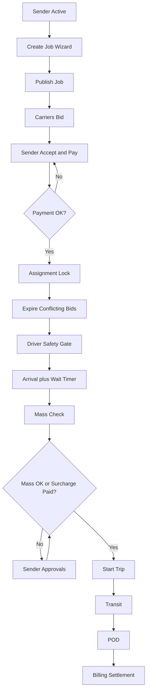
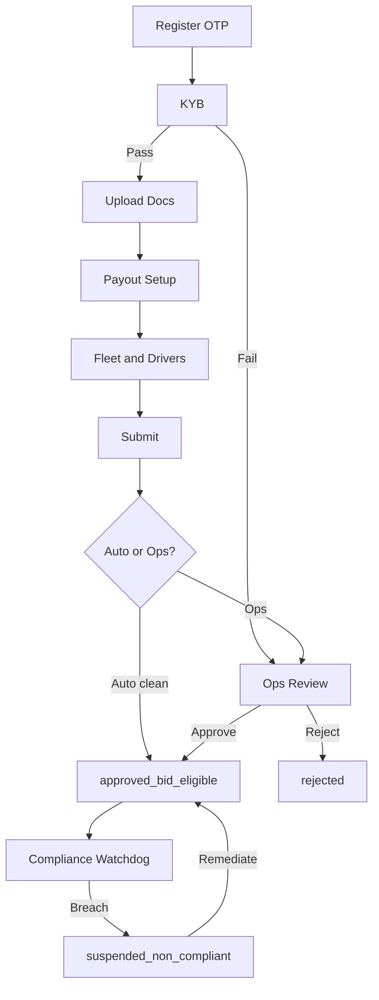
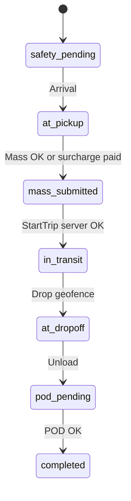
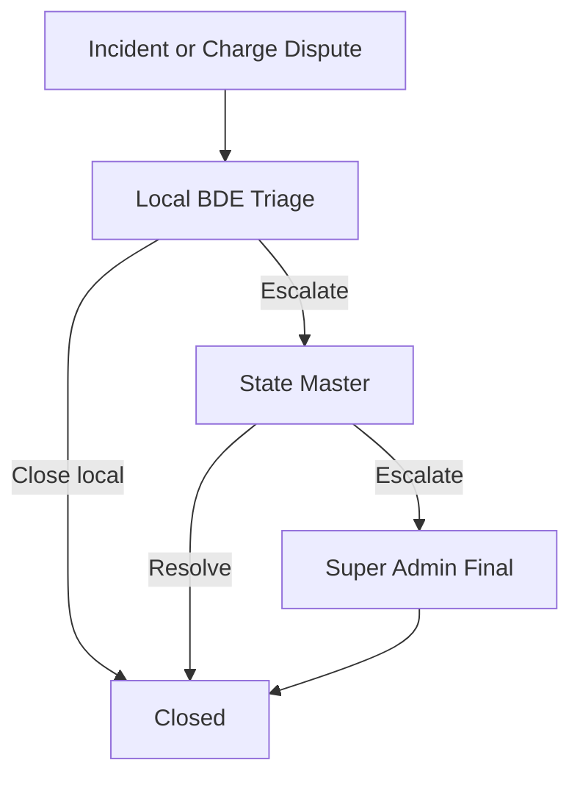

# CLOX — UI/UX Master Specification

**Version:** 1.0  
**Date:** 2026-08-10  
**Status:** Designer-ready single source of truth  
**Operator:** Achieve Global Enterprises Pty Ltd (trading as CLOX Freight Forwarding)  
**Geography:** Australia-first (Victoria HQ)  
**Audience:** UI/UX Designers, Product Managers, Frontend/Backend Engineers, QA, AI UI generation tools  

**Rule of interpretation:** If a behavior is not documented in `/docs`, it is marked `NEEDS CLARIFICATION`. Do not invent product features.

**Related sources:** See §2 Documentation Inventory. Cross-document conflicts: §27. Missing requirements: §26.

---

## 1. Executive Summary

CLOX is a **compliance-first full-load freight marketplace (FLT/FTL)** that connects **Senders** (shippers) with **Transport Companies** (carriers) and **Drivers**. Senders publish RFPs (not direct truck booking); compliant carriers bid with specific vehicle + driver; senders pay **100% upfront** (Model A default); drivers execute **safety-gated** trips with geofence waiting, mass check, and digital POD.

The platform uses a **three-tier admin hierarchy** (Super / State Master / Local BDE) with automated revenue attribution (carrier ~70%, platform 30% split 15%/10%/5%).

### Delivery surfaces

| Surface | Users | Purpose |
|---------|-------|---------|
| Public web (`clox.com.au`) | Anonymous + leads | Landing, registry, Admin EOI, Investor Portal, legal |
| Ops / Admin web | Super, State, Local BDE | Compliance, disputes, policy, revenue, growth |
| Carrier web | Transport Company | Onboarding, marketplace, fleet, bids, assignments |
| Sender web | Sender | Onboarding, job create, proposals, pay |
| Sender mobile | Sender | Track, approvals, account |
| Driver web | Driver | Invite accept + profile only |
| Driver mobile | Driver | Trip execution gates + POD |

### Phase scope (UI must respect)

| In Phase 1 | Out of Phase 1 (do not design as live unless labeled Phase 2) |
|------------|--------------------------------------------------------------|
| OTP onboarding, KYB/KYC, compliance gate | Full AFM / EWD fatigue automation |
| Job create, bid, pay, trip gates, POD | Fleet+ profit engine / ML dispatch |
| Geofence wait + surcharge flows | Monoova live payouts (Phase 0/1 pilot uses Stripe Connect) |
| Pre-launch capture (registry / EOI / investor) | Cross-border regulation |
| Hourly Pattern A/B + run sheet PDF | Light courier / motorbike / car as primary FLT enum |

### Design principles (from docs)

1. **Safety-first** — gated UI; server state is source of truth for payment, bid eligibility, trip start.
2. **High contrast for drivers** — large CTAs, status semantics Green / Amber / Red.
3. **Web-first onboarding** — mobile apps are login + operational only in Phase 1.
4. **Timestamps** — server NTP for POD/arrival; never device clock.
5. **UI first** — freeze journeys and safety gates before backend implementation.

---

## 2. Documentation Inventory

Every file under `/docs` was inspected. Empty file noted.

| Document | Type | Purpose | Important Topics | Related Modules |
|----------|------|---------|------------------|-----------------|
| `PRD.md` | Requirements | Product functional requirements | FR-1…FR-8, roles, non-goals | All marketplace |
| `BRD.md` | Business | Objectives, rules, revenue, scope | 70/30, 4hr min, volumetric, KYB | Billing, compliance |
| `system-design.md` | Technical | Architecture + E2E payment models | Model A/B, trip SM, APIs | Jobs, payments, trips |
| `security.md` | Security | RBAC, sessions, audit | OTP, least privilege | Auth, admin |
| `basic-flow-visual.md` | Diagram | E2E happy path | Job → bid → pay → POD | Marketplace |
| `basic-workflow.md` | — | **EMPTY (0 bytes)** | — | — |
| `useronboarding.md` | Workflow | Sender + Driver states | OTP, KYB/KYC, invite | Onboarding |
| `transportcompanyonboarding.md` | Workflow | Carrier state machine | Compliance vault, bid gate | Carrier |
| `transportcompanyonboarding-sequence.md` | Sequence | Auto vs Ops approve | Hybrid activation | Carrier, Ops |
| `thirdparty-integration.md` | Integration | Stripe, Radar, Maps, KYB, Monoova | Failure handling | Payments, geo |
| `ai-integration.md` | Strategy | Rules-first AI | No AI on safety gates | Matching |
| `MILESTONES.md` | Program | M0–M12 sequencing | Screen-flow checklist | Delivery |
| `MILESTONES-AUSTRALIA.md` | Program | AU pilot gates | Gate 0 | Delivery |
| `GO-LIVE-RUNBOOK.md` | Ops | Go-live steps | Launch checklist | Ops |
| `PRE-LAUNCH-IMPLEMENTATION-PLAN.md` | Implementation | Phase 0 stack + screens | Routes, brand tokens, leads | Pre-launch |
| `TPM-DOCUMENT-ANALYSIS.md` | Analysis | Conflicts C1–C10, gaps | ADRs required | All |
| `screen-flows/README.md` | UX index | Role matrix, shared screens, tokens | Screen ID convention | All UI |
| `screen-flows/sender.md` | Wireframe | Sender flows | SND-* screens | Sender |
| `screen-flows/driver.md` | Wireframe | Driver flows | DRV-* screens | Driver |
| `screen-flows/transport-company.md` | Wireframe | Carrier flows | TCO-* screens | Carrier |
| `screen-flows/super-admin.md` | Wireframe | Super Ops | OPS-SUP-* | Ops |
| `screen-flows/state-master-admin.md` | Wireframe | State Ops | OPS-STA-* | Ops |
| `screen-flows/local-bde-admin.md` | Wireframe | Local BDE | OPS-LOC-* | Ops |
| `product/p1-functional-specification.md` | Spec | Primary functional blueprint | Gates, commission, hourly | Core |
| `product/ui-base-plan.md` | UX | Role UI objectives | Tokens, hardcoded rules | UI |
| `product/technical-operational-specification.md` | Spec | Detailed workflows + checklist | Breakdown 11 screens | Execution |
| `product/vehicle-pricing-and-load-types.md` | Reference | Tariffs, load types, selection | Fit indicators | Job create |
| `product/ai-strategy-clarification.md` | Strategy | UI-first decision | Auto-logic rules | Matching |
| `operations/administrative-hierarchy-revenue-flow.md` | Ops | Revenue tiers | Attribution by origin | Finance |
| `operations/hourly-run-sheet-spec.md` | Spec | Hourly PDF billing artifact | Odometer, 4hr floor | Driver, billing |
| `partners/pre-launch-strategy.md` | GTM | Three funnels | Routes, admin queues | Pre-launch |
| `partners/pre-launch-registry.md` | Form | Sender/carrier waitlist | Fields, infra cards | Pre-launch |
| `partners/admin-eoi-form.md` | Form | State/Local EOI | Exact fields | Pre-launch |
| `partners/investor-portal-form.md` | Form | Equity pre-qual | Capital bands | Pre-launch |
| `partners/admin-partner-eoi-program.md` | Program | Partner program notes | EOI vs investor | Pre-launch |
| `legal/pre-launch-terms-and-conditions.md` | Legal | Website ToS | Acceptance, liability | Public |
| `legal/pre-launch-privacy-policy.md` | Legal | Privacy | PII collection | Public |
| `legal/global-legal-framework.md` | Legal | Framework v2.0 | Counsel review required | Compliance |
| `compliance/nhvr-work-rest-reference.md` | Reference | NHVR work/rest | Phase 2 input | Driver |
| `company/clox-about-us.md` | Marketing | Positioning | Tagline, pillars | Landing |
| `reference/australian-competitor-portals.md` | Reference | Competitor links | Competitive UX | Research |
| `sources/README.md` | Index | PDF→MD map | Source of truth | Docs hygiene |

**External referenced (not in `/docs` as files):** Sender/Carrier Job PNG diagram; legacy `Pre-Launch/` HTML; brand assets under `img/`.

---

## 3. Product Overview

### Purpose

Digitize full-load freight booking, compliance, assignment, trip evidence, and settlement for Australia, reducing disputes and under-booking / wrong-vehicle incidents.

### Business problem

Fragmented, manual, dispute-prone freight booking and dispatch with weak evidence and compliance gates.

### Target users

1. Corporate / individual **Senders**
2. **Transport Companies** and their **Drivers**
3. Platform **Super / State / Local BDE Admins**
4. Pre-launch: registry leads, admin partner EOIs, investors

### Main goals

- Compliant marketplace with bid eligibility gate
- Transparent pricing + vehicle eligibility
- Controlled assignment lock + conflict expiry
- Auditable trip execution + POD
- Automated waiting / discrepancy charge workflows
- Sustainable 30% platform economics with regional revenue share

### Important business concepts

| Concept | Meaning |
|---------|---------|
| RFP / Job | Sender request for proposals (not instant book a truck) |
| Chargeable weight | `max(dead weight, volumetric)` where volumetric = `(L×W×H cm)/4000` |
| Fit indicator | Perfect / Extra space / Overload risk (blocked) |
| Assignment lock | Winning vehicle + driver reserved; conflicting bids expire |
| Gate A / Gate B | Pre-trip safety checklist / Mass check |
| Free wait | Policy window (pickup 30 min documented; drop 60 min in tech ops) |
| Model A / Model B | Pay 100% on accept vs deposit on publish + balance on accept |
| Origin attribution | Admin revenue attributed by load origin state/city |
| 4th night | Fortnightly (14-day) admin payout cycle phrase |

### Major entities

`User`, `Company` (Sender / Carrier), `Vehicle`, `Driver`, `Job`, `Proposal`, `Assignment`, `Trip`, `Incident`, `PaymentEvent`, `PODEvidence`, `ComplianceDocument`, `Lead` (Phase 0), `RunSheet` (hourly), `PolicyVersion`, `PerformanceScore` (later).

### External systems

Stripe Connect, easyAML/Trulioo, Radar.com, Google Maps/Routes (Valhalla ADR), ABR, Twilio Proxy (optional), Monoova (deferred), email SMTP.

### Product hierarchy

```text
CLOX Platform
│
├── Pre-Launch (Phase 0)
│   ├── Public Landing
│   ├── Registry (Sender / Carrier)
│   ├── Admin Partner EOI
│   ├── Investor Portal
│   └── Super Admin Lead Console
│
├── Identity & Auth
│   ├── OTP Login / Register
│   ├── Sessions & devices
│   └── Profile & notifications
│
├── Sender Experience
│   ├── Onboarding (KYB/KYC → Payment)
│   ├── Job Create & Publish (Per-km / Hourly)
│   ├── Proposals & Accept + Pay
│   ├── Tracking
│   └── Approvals (surcharge / waiting)
│
├── Transport Company Experience
│   ├── Onboarding (KYB → Docs → Payout → Fleet → Drivers)
│   ├── Compliance Vault
│   ├── Marketplace & Bidding
│   ├── Assignment Monitor
│   ├── Fleet & Drivers
│   └── Wallet / Settlements (read)
│
├── Driver Experience
│   ├── Invite & Profile (Web)
│   └── Trip Execution (Mobile): Gates → Transit → POD → Run sheet inputs
│
├── Ops Portal
│   ├── Super Admin (national, policy, finance, admins)
│   ├── State Master (state compliance, disputes, team)
│   └── Local BDE (growth, first-line support)
│
└── Shared Platform Services (backend-facing, UI surfaces)
    ├── Payments & surcharges
    ├── Geofencing / dwell
    ├── Notifications
    ├── Documents / media
    └── Audit & settlements
```

---

## 4. User Roles

### 4.1 Super Admin (HQ)

| Attribute | Definition |
|-----------|------------|
| Purpose | Global governance, pricing/policy, final override |
| Responsibilities | National dashboard, compliance all regions, dispute final ruling, tariff publish, provision admins, settlements, suspend orgs |
| Modules | Ops portal (all), Pre-launch lead console |
| Data visibility | National, unfiltered |
| Approvals | All regions compliance; final disputes; policy publish |
| Special | Step-up OTP for sensitive actions; ★ Super-only nav |

### 4.2 State Master Admin

| Attribute | Definition |
|-----------|------------|
| Purpose | Regional oversight for assigned state(s) |
| Responsibilities | State compliance approve/reject, state disputes, Local BDE team management, state revenue snapshot |
| Modules | Ops portal (state-scoped) |
| Data visibility | Assigned state only |
| Approvals | In-state compliance; escalate KYB override to Super |
| Special | Cannot edit global policy; cannot create Super Admin |

### 4.3 Local BDE Admin

| Attribute | Definition |
|-----------|------------|
| Purpose | Local growth pipeline + first-line support |
| Responsibilities | Prospects, chase docs, first-line dispute triage, local revenue read-only |
| Modules | Ops portal (territory-scoped) |
| Data visibility | Local territory only |
| Approvals | Default: view + comment; approve only if policy grants (`REQUIRES CLARIFICATION` per deployment) |
| Special | Growth pipeline unique to this role |

### 4.4 Sender

| Attribute | Definition |
|-----------|------------|
| Purpose | Book and pay for full-load transport |
| Responsibilities | Onboard, create RFP, review/accept proposals, pay, track, approve surcharges |
| Platforms | Web (onboard + book) + Mobile (track + approve) |
| Restrictions | Cannot bid, manage fleet, run driver gates, access Ops |

### 4.5 Transport Company (Carrier)

| Attribute | Definition |
|-----------|------------|
| Purpose | Bid, assign resources, execute via drivers |
| Responsibilities | Compliance vault, fleet/drivers, marketplace bids, assignment monitor, breakdown response |
| Platforms | Web primary |
| Restrictions | Cannot create sender jobs, accept proposals as sender, Ops portal, driver safety gates |

### 4.6 Driver

| Attribute | Definition |
|-----------|------------|
| Purpose | Execute trip and collect proof |
| Responsibilities | Profile/licence, pre-trip, arrival, mass check, transit, POD, breakdown report, odometer (hourly) |
| Platforms | Web invite + Mobile execution |
| Restrictions | Cannot create jobs, bid, pay, Ops |

### 4.7 Pre-launch personas (not marketplace roles)

- Registry Sender / Registry Carrier (lead)
- EOI applicant (State Master or Local BDE aspirant)
- Investor applicant

---

## 5. Permission Matrix

Legend: Y = allowed · N = not allowed · * = policy-configurable · RC = `REQUIRES CLARIFICATION`

| Module | Screen / Capability | Super | State | Local | TCO | Sender | Driver |
|--------|---------------------|:-----:|:-----:|:-----:|:---:|:------:|:------:|
| Auth | Login OTP | Y | Y | Y | Y | Y | Y |
| Auth | Self-service signup | N | N | N | Y | Y | Via invite |
| Pre-launch Admin | Lead queues (registry/EOI/investor) | Y | N | N | N | N | N |
| Ops Dashboard | National KPIs | Y | N | N | N | N | N |
| Ops Dashboard | State KPIs | Y | Y | N | N | N | N |
| Ops Dashboard | Local KPIs / tasks | Y | Y | Y | N | N | N |
| Compliance | View queue | Y | Y | Y | N | N | N |
| Compliance | Approve / Reject | Y | Y | * | N | N | N |
| Compliance | KYB override | Y | Escalate | N | N | N | N |
| Policy / Tariffs | Edit / Publish | Y | N | N | N | N | N |
| Admins | Provision State/Local | Y | Local only* | N | N | N | N |
| Disputes | Final ruling | Y | State | First-line | N | Dispute request | N |
| Finance | Full settlements | Y | State share | Local share | Wallet | Invoices | N |
| Jobs | Create / Publish | N | N | N | N | Y | N |
| Jobs | Bid / Propose | N | N | N | Y | N | N |
| Jobs | Accept & Pay | N | N | N | N | Y | N |
| Trip | Safety / Mass / Start / POD | N | N | N | Monitor | Track/Approve | Y |
| Fleet | Manage vehicles/drivers | N | N | N | Y | N | Profile only |
| Org | Suspend / Reactivate | Y | RC | N | N | N | N |
| Export | CSV leads / finance | Y | RC | RC | RC | Invoices | N |

---

## 6. Modules

### Module: Pre-Launch Capture

- **Purpose:** Capture registry, Admin EOI, Investor leads before marketplace.
- **Users:** Public applicants; Super Admin review.
- **Features:** Landing; 3-step registry; EOI form; Investor form; legal pages; Super Admin queues, notes, status, CSV.
- **Entities:** `Lead`, `LeadNote`, `LeadEvent`, `AdminUser`.
- **Dependencies:** Auth OTP (admin), email notify, Privacy/Terms.
- **Entry:** `clox.com.au` routes; admin `dev.clox.com.au`.
- **Exit:** Manual progression to M3/M4 onboarding (no auto-provision).

### Module: Identity & Auth

- **Purpose:** OTP auth, sessions, RBAC.
- **Users:** All roles.
- **Features:** Login, OTP verify, resend, logout, session revocation, step-up for sensitive ops.
- **Dependencies:** Notification channel for OTP.

### Module: Sender Onboarding & Account

- **Purpose:** Activate sender for booking.
- **States:** `sender_draft` → … → `sender_active` (see §18).
- **Features:** Account type, KYB/KYC, invoice profile, Stripe PM, profile.

### Module: Job / RFP Marketplace

- **Purpose:** Create, broadcast, bid, award.
- **Features:** Per-km / Hourly, site access, vehicle class recommendation, proposals, assignment lock, conflict expiry.
- **Dependencies:** Compliance gate, payments, routing.

### Module: Payments

- **Purpose:** Capture fare, deposit (Model B), surcharges, settlement refs.
- **Features:** Pay on accept, SCA/3DS, failed/retry, waiting/mass surcharge.
- **Dependencies:** Stripe Connect.

### Module: Trip Execution

- **Purpose:** Safety-gated trip lifecycle + POD.
- **Features:** Gate A, geofence arrival, Gate B, start trip, transit, break, breakdown, POD, hourly run sheet.
- **Dependencies:** Radar, documents storage, payments unlock.

### Module: Carrier Compliance & Fleet

- **Purpose:** Bid eligibility vault.
- **Features:** Docs upload, RWC, payout setup, vehicles, drivers, suspension on expiry.

### Module: Ops Compliance / Disputes / Policy / Finance

- **Purpose:** Governance and support.
- **Features:** Queues, approve/reject, dispute rulings, tariff versions, fortnightly settlements, admin provision, growth pipeline (Local).

### Module: Notifications

- **Purpose:** Push/email/inbox for lifecycle events.
- **Features:** Shared inbox `SHR-NOTIF-01`; role-specific push.

### Module: Fleet+ (Phase 2 — label only)

- Profit engine, maintenance lockout, watchdogs. **Do not ship as Phase 1 primary UI.**

---

## 7. Information Architecture

### Public web

```text
Landing (/)
├── Registry (/registry)
├── Partner EOI (/partner/eoi)
├── Investors (/investors)
├── Privacy (/privacy)
└── Terms (/terms)
```

### Shared auth

```text
Login (SHR-AUTH-01)
└── OTP Verify (SHR-AUTH-02)
    └── Role home / onboarding entry
```

### Sender (Web)

```text
Sender Home / Jobs
├── Onboarding wizard (if not active)
├── Create Job (5 steps)
├── Job Detail
│   ├── Proposals list
│   ├── Proposal detail → Accept & Pay
│   └── Track (web)
├── Approvals (surcharge/waiting)
├── Invoices
└── Account (SHR-PROF-01)
```

### Sender (Mobile)

```text
Tab: Home | Track | Approvals | Account
├── Active job card → Track map
├── Approvals inbox → Pay / Dispute
└── Account
```

### Transport Company (Web)

```text
Dashboard
├── Onboarding wizard (until bid eligible)
├── Marketplace → Job detail → Bid composer
├── My Proposals
├── Assignments → Trip timeline
├── Fleet → Add vehicle
├── Drivers → Invite
├── Documents / Compliance vault
├── Wallet / Finance
└── Account
```

### Driver

```text
Web: Invite → OTP/Password → Licence → Policies → Ready
Mobile tabs: Home | Trips | Account
├── Today → Trip overview → Gates → Transit → POD
└── History / Profile
```

### Ops portal (role-filtered sidebar)

```text
Dashboard
├── Compliance
├── Users / Orgs
├── Jobs
├── Disputes
├── Finance / Revenue
├── Policy ★ (Super)
├── Admins ★ (Super) / Team (State)
├── Growth (Local)
├── Audit
└── System ★ (Super)
```

---

## 8. Navigation Structure

### 8.1 Design tokens for nav

| Item | Spec |
|------|------|
| Mobile bottom nav (Sender) | Home · Track · Approvals · Account |
| Mobile bottom nav (Driver) | Home · Trips/Tasks · Account |
| Web ops | Left sidebar + top bar (logo, notifications, user menu) |
| Carrier web | Top or side nav: Dashboard · Market · Bids · Fleet · Docs · Finance |

### 8.2 Nav items detail

| Label | Icon suggestion | Parent | Children | Roles | Default? | Breadcrumb |
|-------|-----------------|--------|----------|-------|----------|------------|
| Dashboard | LayoutDashboard | Root | — | Ops tiers | Yes (ops) | Ops › Dashboard |
| Compliance | ShieldCheck | Root | Queue, Detail | Ops | No | Ops › Compliance › {Org} |
| Disputes | Scale | Root | List, Detail | Ops | No | Ops › Disputes › {ID} |
| Policy | Sliders | Root | List, Edit version | Super | No | Ops › Policy › {Name} |
| Admins | Users | Root | List, Provision | Super | No | Ops › Admins |
| Team | UserCog | Root | List, Detail | State | No | Ops › Team › {Name} |
| Growth | TrendingUp | Root | Pipeline, Prospect | Local | No | Ops › Growth › {Co} |
| Finance | Wallet | Root | Cycle, Reconcile | Ops (scoped) | No | Ops › Finance |
| Marketplace | Map | Root | List, Job, Bid | TCO | Often | Carrier › Market › {Job} |
| Fleet | Truck | Root | List, Add | TCO | No | Carrier › Fleet |
| New Job | Plus | Root | Wizard steps | Sender | No | Jobs › New › Step N |
| Approvals | CheckCircle | Tab | List, Detail | Sender mobile | No | Approvals › {Item} |
| Notifications | Bell | Header | Inbox | All | No | Notifications |
| Account | User | Root/Tab | Profile, PM, Sign out | All | No | Account |

---

## 9. Entity Overview

### Relationships (conceptual)

```text
SenderCompany 1──* Job 1──* Proposal *──1 TransportCompany
Job 1──0..1 Assignment 1──1 Trip
Assignment *──1 Vehicle
Assignment *──1 Driver
TransportCompany 1──* Vehicle
TransportCompany 1──* Driver
Trip 1──* Incident
Trip 1──0..1 PODEvidence
Trip 1──0..1 RunSheet (hourly)
Job 1──* PaymentEvent
Company 1──* ComplianceDocument
Lead (Phase 0) independent until promotion
AdminUser scopes State/Territory
```

### Key fields (UI-facing)

| Entity | Critical fields for UI |
|--------|------------------------|
| Job | id, mode (per_km/hourly), stops, load, site access, vehicle_min_class, status, payment_model A\|B, gross estimate |
| Proposal | carrier (masked rules RC), vehicle, driver, ETA, price/gross, status |
| Trip | phase/state, gates booleans, geofence times, wait timers |
| Vehicle | rego, class, GVM, RWC expiry, status (Active/MAINTENANCE Phase2) |
| Driver | licence class/number/expiry, status |
| Lead | type, status, payload JSON, notes |

---

## 10. Business Rules (UI must enforce / reflect)

| ID | Rule | UI implication |
|----|------|----------------|
| BR-01 | Hourly minimum 4 hours | Show billed vs actual; floor on estimate |
| BR-02 | Chargeable = max(dead, L×W×H/4000) | Live calc on load screen |
| BR-03 | Undersized vehicle disabled | Disabled rows + reason |
| BR-04 | Larger vehicle allowed with repricing | Enabled “Extra space” options |
| BR-05 | Per-km: 1 pickup + 1 drop | Hide multi-stop widget |
| BR-06 | Hourly: Pattern A (≤3 pickup→1 drop) or B (1 pickup→≤3 drops); max 4 locations | Pattern selector; enforce counts |
| BR-07 | Site access mandatory before publish | Block publish if incomplete |
| BR-08 | DG > 1000 kg → manifest upload | Conditional file field |
| BR-09 | Carrier cannot bid until approved_bid_eligible | Marketplace gated / vault lock |
| BR-10 | Bid requires vehicle + driver + ETA | Disable submit until set |
| BR-11 | Overlapping resource bids expire on award | Status “Expired (conflict)” |
| BR-12 | Sender pays 100% upfront (Model A) | Accept & pay flow |
| BR-13 | Trip start blocked until payment + Gate A + Gate B (+ surcharge paid if any) | Grey START TRIP |
| BR-14 | Tracking visible to sender only after trip start | Map empty/locked before |
| BR-15 | Free wait pickup 30 min; notify; overage charge workflow | Countdown + Approvals |
| BR-16 | Drop free wait 60 min (tech ops) | Same pattern |
| BR-17 | Mass > declared → surcharge; block start | Driver blocked; sender Approvals |
| BR-18 | Fail critical pre-trip → vehicle LOCKED | Cannot proceed |
| BR-19 | POD: SOG + photos + server timestamp + GPS | Mandatory fields |
| BR-20 | Server NTP timestamps | Never show “device time” as legal time |
| BR-21 | Odometer |Manual−GPS| > 10% → Super flag | Warning + ops queue |
| BR-22 | Fatigue planning: if duration > 5.25h insert 15-min unpaid rest in ETA; sender cannot override | Read-only rest in ETA |
| BR-23 | Taking Break pauses GPS/ETA visibility (Phase 1) | Driver control; no HVNL adjudication |
| BR-24 | Revenue: Carrier 70%; Super 15%; State 10%; Local 5% | Finance UIs |
| BR-25 | Admin payout fortnightly; carrier withdraw T+7 post-POD (audit) — conflict see §27 | Label carefully |
| BR-26 | Attribution by origin state/city | Admin filters |
| BR-27 | Tax invoice ≥ $1000 needs name/address (ATO) | Invoice profile gate |
| BR-28 | Phase 1 vehicle enum recommend 3T+ (ADR) | Do not promote motorbike/car as FLT default |
| BR-29 | Gated actions never trust client flags | Disable + server error if bypassed |
| BR-30 | Incorrect load type → rejection/charges disclaimer | Legal checkbox/text |

---

## 11. End-to-End Workflows

### WF-AUTH-001 — Authentication (all roles)

```text
Workflow: Login with OTP
Actor: Any role
Trigger: User opens login
Preconditions: Account exists (or signup path)
Flow:
1. User opens SHR-AUTH-01
2. Enters email or mobile
3. System sends OTP
4. User opens SHR-AUTH-02, enters code
5. System validates; issues session
6. Route to role dashboard or onboarding
Success: Authenticated session
Failure: Invalid OTP → inline error; resend cooldown shown
Alternative: Sign up link for Sender/TCO
Exception: Rate limit / locked → error state; RC for lockout duration
```

### WF-SND-001 — Sender onboarding

```text
Actor: Sender
Trigger: Create account
Flow: Welcome → Register/OTP → Account type → KYB/KYC → Invoice profile → Payment setup → sender_active
Gated: Booking disabled until sender_active + payment ready
Failure: Manual review → sender_pending_review; Reject → terminal
```

### WF-SND-002 — Create & publish job (Model A)

```text
Actor: Sender (active)
Flow: Lane → Load → Site → Vehicle class → Review & Publish → published (open for bids)
Validation: chargeable weight, site mandatory, undersized disabled, DG rules
Alternative Model B: Pay deposit before open_for_bids
```

### WF-SND-003 — Accept proposal & pay

```text
Actor: Sender
Flow: Proposals inbox → Detail → Accept & pay → Stripe (pending/SCA/failed/success) → paid_and_confirmed
Side effect: Assignment lock; conflicting bids expire
Gated: Trip execution blocked until paid_and_confirmed
```

### WF-SND-004 — Track shipment

```text
Actor: Sender (mobile/web)
Trigger: Trip started
Flow: Home active card → Track map + timeline
Precondition: Tracking disabled until Trip_Started
```

### WF-SND-005 — Surcharge / waiting approval

```text
Actor: Sender
Trigger: Mass mismatch or wait overage requiring payment
Flow: Approvals inbox → Detail + evidence → Pay or Dispute → On pay, unlock driver Start Trip
```

### WF-TCO-001 — Carrier onboarding

```text
Actor: Transport Company
Flow: Register → KYB → Docs → Payout → Fleet+Drivers → Submit → auto or Ops review → approved_bid_eligible
Failure: pending_review / rejected / later suspended_non_compliant
```

### WF-TCO-002 — Bid submission

```text
Actor: Bid-eligible carrier
Flow: Marketplace → Job detail → Bid (vehicle+driver+ETA) → Submit → My proposals
Gated: Bidding disabled until truck+driver selected; vault red → locked
```

### WF-TCO-003 — Post-award assignment monitor

```text
Actor: Carrier
Flow: Assignment list → Detail timeline → Handle breakdown notifications (replace/release/repair)
```

### WF-DRV-001 — Driver invite & profile

```text
Actor: Driver
Flow: Accept invite → OTP+password → Licence → Safety/policy ack → driver_active → Install app
```

### WF-DRV-002 — Pre-trip gates & start

```text
Actor: Driver
Flow: Today → Trip overview → Safety checklist → Arrival/geofence → Mass check → START TRIP (server)
Branch: Mass over → block + sender surcharge
Fail critical safety → LOCKED
```

### WF-DRV-003 — Transit, breakdown, POD

```text
Actor: Driver
Flow: Transit chips → optional Taking Break / Report breakdown → Drop geofence → Unload → POD (SOG+photos) → Complete
Hourly: odometer start/end; run sheet PDF generation
```

### WF-OPS-001 — Compliance review

```text
Actor: Super / State (/ Local*)
Flow: Queue → Org detail (KYB, docs, payout, fleet) → Approve | Reject | Request info
```

### WF-OPS-002 — Dispute adjudication

```text
Actor: Local triage → State resolve → Super final
Flow: List → Detail timeline/evidence → Ruling (Sender/Carrier/Split) → optional payout adjust
```

### WF-OPS-003 — Policy publish (Super)

```text
Flow: Policy list → Edit version → Save draft / Publish (effective date, change summary)
```

### WF-OPS-004 — Admin provisioning (Super)

```text
Flow: Admin list → New admin (role, region) → Send invite
```

### WF-OPS-005 — Fortnightly settlements (Super)

```text
Flow: Finance cycle view → Process → Reconciliation mismatches → Export
```

### WF-PL-001 — Pre-launch registry submit

```text
Actor: Public
Flow: Role → Details → Infra acknowledgment → Submit → Thank you
Admin: Queue → Detail → Status/notes/export
```

### WF-PL-002 / WF-PL-003 — EOI / Investor submit

```text
Same pattern with PDF-accurate fields; Investor separate declaration (Corporations Act)
```

### WF-BRK-001 — Breakdown (11-screen sequence)

```text
Driver report → Carrier options (Replace / Release / Repair) → Sender approve replacement or reject/refund → Admin incident tools → Performance score log
Details: technical-operational-specification §5
```

---

## 12. User Journeys

### ADMIN (Super)

```text
OTP Login → National Dashboard → Compliance Queue → Review Carrier → Approve
→ (alt) Disputes → Final ruling
→ (alt) Policy → Publish tariff version
→ (alt) Admins → Provision State/Local
→ (alt) Finance → Process fortnightly cycle
→ (Phase 0) Leads queues → Notes/Status/CSV
→ Account / Sign out
```

### STATE MASTER

```text
OTP Login → State Dashboard → Compliance (state) → Approve/Escalate
→ Disputes → Resolve or Escalate Super / Assign Local
→ Team → Local BDE performance
→ Finance snapshot (10%) → Sign out
```

### LOCAL BDE

```text
OTP Login → Local Dashboard → Growth pipeline → Chase prospect
→ Carriers support checklist → Escalate State
→ Dispute triage → Escalate or close locally
→ Revenue 5% read-only → Sign out
```

### SENDER

```text
Web: Welcome → OTP → KYB/KYC → Invoice → Payment → Active
→ Create Job (5 steps) → Publish → Proposals → Accept & Pay → Success
Mobile: Home → Track → Approvals (surcharge) → Pay → Account
```

### TRANSPORT COMPANY

```text
Register → Compliance vault complete → Bid eligible
→ Marketplace → Bid → Accepted → Assignment monitor
→ (exception) Breakdown management
→ Fleet/Drivers/Docs renewals → Wallet
```

### DRIVER

```text
Invite web → Profile active → App login
→ Today → Pre-trip → Arrival → Mass → Start → Transit → POD → Done
→ (alt) Breakdown / Taking Break / Approvals wait
```

---

## 13. Screen Inventory

| ID | Screen Name | Module | Role | Purpose | Entry | Exit/Next |
|----|-------------|--------|------|---------|-------|-----------|
| SHR-AUTH-01 | Login / Register entry | Auth | All | Email/mobile + send OTP | Deep link / app | SHR-AUTH-02 |
| SHR-AUTH-02 | OTP Verify | Auth | All | Enter OTP | AUTH-01 | Role home |
| SHR-NOTIF-01 | Notifications inbox | Shared | All | List notifications | Bell | Detail / mark read |
| SHR-PROF-01 | Profile & security | Shared | All | Account settings | Account nav | Subpages / logout |
| SHR-403 | Permission denied | Shared | All | Unauthorized | Guard | Back / home |
| SHR-OFFLINE | Offline | Shared | Mobile | Network loss | SW | Retry |
| PUB-LAND-01 | Landing | Pre-launch | Public | Brand + CTAs | `/` | Registry/EOI/Investors |
| PUB-REG-01 | Registry Step 1 Role | Pre-launch | Public | Sender vs Carrier | `/registry` | REG-02 |
| PUB-REG-02 | Registry Step 2 Details | Pre-launch | Public | Role fields | REG-01 | REG-03 |
| PUB-REG-03 | Registry Step 3 Infra ack | Pre-launch | Public | Acknowledge rails | REG-02 | Success |
| PUB-REG-04 | Registry Success | Pre-launch | Public | Confirmation | REG-03 | Landing |
| PUB-EOI-01 | Admin EOI Form | Pre-launch | Public | Partner EOI | `/partner/eoi` | Success |
| PUB-INV-01 | Investor Portal Form | Pre-launch | Public | Equity pre-qual | `/investors` | Success |
| PUB-LEG-01 | Terms | Legal | Public | ToS | Footer | — |
| PUB-LEG-02 | Privacy | Legal | Public | Privacy | Footer | — |
| OPS-PL-DSH-01 | Pre-launch admin dashboard | Pre-launch | Super | KPIs 3 funnels | Admin `/` | Lead queues |
| OPS-PL-LED-01 | Registry leads list | Pre-launch | Super | Table | Nav | Detail |
| OPS-PL-LED-02 | EOI leads list | Pre-launch | Super | Table | Nav | Detail |
| OPS-PL-LED-03 | Investor leads list | Pre-launch | Super | Table | Nav | Detail |
| OPS-PL-LED-04 | Lead detail | Pre-launch | Super | Payload, notes, status | List | List |
| OPS-PL-AUD-01 | Activity / audit | Pre-launch | Super | Audit log | Nav | — |
| OPS-SUP-DSH-01 | National dashboard | Ops | Super | KPIs + priority queue | Login | Queues |
| OPS-SUP-CMP-01 | Compliance queue | Ops | Super | National queue | Nav | CMP-02 |
| OPS-SUP-CMP-02 | Compliance review detail | Ops | Super | Approve/reject | CMP-01 | Outcomes |
| OPS-SUP-DSP-01 | Disputes list | Ops | Super | National disputes | Nav | DSP-02 |
| OPS-SUP-DSP-02 | Dispute detail | Ops | Super | Ruling | DSP-01 | Resolved |
| OPS-SUP-POL-01 | Policy list | Ops | Super | Tariff versions | Nav | POL-02 |
| OPS-SUP-POL-02 | Policy edit/publish | Ops | Super | Version editor | POL-01 | POL-01 |
| OPS-SUP-ADM-01 | Admin management | Ops | Super | List admins | Nav | ADM-02 |
| OPS-SUP-ADM-02 | Provision admin | Ops | Super | Invite form | ADM-01 | ADM-01 |
| OPS-SUP-FIN-01 | Finance cycle | Ops | Super | Fortnightly | Nav | FIN-02 |
| OPS-SUP-FIN-02 | Reconciliation | Ops | Super | Mismatches | FIN-01 | — |
| OPS-SUP-USR-02 | Org suspend | Ops | Super | Suspend/reactivate | Org detail | Confirm |
| OPS-STA-DSH-01 | State dashboard | Ops | State | State KPIs | Login | — |
| OPS-STA-CMP-01/02 | State compliance | Ops | State | Queue/detail | Nav | Outcomes |
| OPS-STA-DSP-01/02 | State disputes | Ops | State | Resolve/escalate | Nav | — |
| OPS-STA-TEAM-01/02 | Local BDE team | Ops | State | Manage BDEs | Nav | — |
| OPS-STA-FIN-01 | State revenue | Ops | State | 10% snapshot | Nav | — |
| OPS-LOC-DSH-01 | Local dashboard | Ops | Local | Tasks | Login | — |
| OPS-LOC-GRW-01/02 | Growth pipeline | Ops | Local | Prospects | Nav | — |
| OPS-LOC-CAR-01/02 | Carrier support | Ops | Local | Checklist | Nav | Escalate |
| OPS-LOC-DSP-01/02 | Dispute triage | Ops | Local | Evidence checklist | Nav | Escalate |
| OPS-LOC-FIN-01 | Local revenue | Ops | Local | 5% read-only | Nav | — |
| SND-ONB-01 | Welcome | Sender | Sender | Value prop | Web | AUTH/ONB |
| SND-ONB-02 | Account type | Sender | Sender | Business/Individual | ONB | ONB-03 |
| SND-ONB-03 | Verification | Sender | Sender | ABN or ID | ONB-02 | ONB-04 |
| SND-ONB-04 | Invoice profile | Sender | Sender | Legal/GST | ONB-03 | ONB-05 |
| SND-ONB-05 | Payment setup | Sender | Sender | Stripe PM | ONB-04 | Active home |
| SND-JOB-01 | New job lane | Jobs | Sender | Mode + stops + time | New job | JOB-02 |
| SND-JOB-02 | Load details | Jobs | Sender | Weight/dims/types | JOB-01 | JOB-03 |
| SND-JOB-03 | Site access | Jobs | Sender | Maneuver/dock/clear | JOB-02 | JOB-04 |
| SND-JOB-04 | Vehicle class | Jobs | Sender | Min class + fit | JOB-03 | JOB-05 |
| SND-JOB-05 | Review & publish | Jobs | Sender | Confirm publish | JOB-04 | Job detail |
| SND-PAY-02 | Deposit pay (Model B) | Payments | Sender | Deposit before bids | JOB-05 | Open bids |
| SND-PRP-01 | Proposals list | Jobs | Sender | Compare bids | Job | PRP-02 |
| SND-PRP-02 | Proposal detail | Jobs | Sender | Accept & pay | PRP-01 | Payment states |
| SND-PRP-03 | Payment success | Payments | Sender | Confirmed | Pay | Track |
| SND-PAY-P | Payment pending | Payments | Sender | Processing | Accept | Success/Fail |
| SND-PAY-F | Payment failed | Payments | Sender | Retry | Accept | Retry |
| SND-PAY-A | Payment requires_action | Payments | Sender | 3DS | Accept | Success |
| SND-MOB-01 | Mobile home | Sender mobile | Sender | Active jobs | Tab | Track |
| SND-MOB-02 | Track map | Sender mobile | Sender | Live track | Home | — |
| SND-MOB-03 | Approvals inbox | Sender mobile | Sender | Surcharges | Tab | SRG |
| SND-SRG-01 | Surcharge detail | Approvals | Sender | Pay/Dispute | Inbox | Success |
| SND-TRK-01 | Activity / web track | Sender web | Sender | Event log | Job | — |
| TCO-ONB-01…08 | Carrier onboarding wizard | Carrier | TCO | 8-step activation | Signup | Bid eligible |
| TCO-DSH-01 | Carrier dashboard | Carrier | TCO | Overview | Login | Market |
| TCO-MKT-01 | Marketplace list | Carrier | TCO | Open jobs | Nav | MKT-02 |
| TCO-MKT-02 | Job detail | Carrier | TCO | Requirements | MKT-01 | BID-01 |
| TCO-BID-01 | Bid composer | Carrier | TCO | Vehicle/driver/ETA | MKT-02 | BID-02 |
| TCO-BID-02 | My proposals | Carrier | TCO | Proposal statuses | Nav | ASN |
| TCO-ASN-01 | Assignments list | Carrier | TCO | Active work | Nav | ASN-02 |
| TCO-ASN-02 | Assignment / trip timeline | Carrier | TCO | Monitor | ASN-01 | Exception |
| TCO-FLT-01 | Fleet list | Carrier | TCO | Vehicles | Nav | FLT-02 |
| TCO-FLT-02 | Add/Edit vehicle | Carrier | TCO | Vehicle form | FLT-01 | FLT-01 |
| TCO-DRV-01 | Drivers list | Carrier | TCO | Drivers | Nav | DRV-02 |
| TCO-DRV-02 | Invite driver | Carrier | TCO | Invite form | DRV-01 | DRV-01 |
| TCO-DOC-01 | Compliance documents | Carrier | TCO | Vault + renewals | Nav | Upload |
| TCO-WAL-01 | Financial wallet | Carrier | TCO | Pending/available | Nav | Withdraw RC |
| DRV-WEB-01 | Invite landing | Driver web | Driver | Accept invite | Email link | WEB-02 |
| DRV-WEB-02 | OTP + password | Driver web | Driver | Credentials | WEB-01 | WEB-03 |
| DRV-WEB-03 | Licence profile | Driver web | Driver | Licence fields | WEB-02 | WEB-04 |
| DRV-WEB-04 | Safety & policy | Driver web | Driver | Acknowledgements | WEB-03 | WEB-05 |
| DRV-WEB-05 | Ready / app install | Driver web | Driver | CTA stores | WEB-04 | App |
| DRV-MOB-01 | Today | Driver mobile | Driver | Active jobs | Tab | MOB-02 |
| DRV-MOB-02 | Trip overview | Driver mobile | Driver | Gates checklist | MOB-01 | MOB-03 |
| DRV-MOB-03 | Safety check Gate A | Driver mobile | Driver | Checklist | MOB-02 | MOB-04 |
| DRV-MOB-04 | At pickup / arrival | Driver mobile | Driver | Geofence + wait | MOB-03 | MOB-05 |
| DRV-MOB-05 | Mass check Gate B | Driver mobile | Driver | Mass + restraints | MOB-04 | MOB-06 |
| DRV-MOB-06 | Ready / Start trip | Driver mobile | Driver | Start CTA | MOB-05 | MOB-07 |
| DRV-MOB-07 | In transit | Driver mobile | Driver | Status + actions | Start | MOB-08/10 |
| DRV-MOB-08 | At dropoff | Driver mobile | Driver | Unload | Transit | MOB-09 |
| DRV-MOB-09 | POD capture | Driver mobile | Driver | SOG + photos | MOB-08 | Success |
| DRV-MOB-10 | Report breakdown | Driver mobile | Driver | Incident | Transit | Submitted |
| DRV-MOB-11 | Taking break | Driver mobile | Driver | Break mode | Transit | Resume |
| DRV-MOB-12 | Trip history | Driver mobile | Driver | Past trips | Account | Detail |
| DRV-MOB-13 | Driver account | Driver mobile | Driver | Profile | Tab | — |
| DRV-MOB-14 | Odometer input | Hourly | Driver | Start/end odo | Shift/final | Continue |
| BRK-01…11 | Breakdown sequence screens | Exception | Multi | Replace/repair/cancel | Report | Complete |
| MOD-* | Shared modals | Shared | Varies | Confirmations | Actions | Close |

---

## 14. Detailed Screen Specifications

> Pattern note: Screens sharing the same layout family are specified fully once; variants call out deltas. All **Gated** screens must disable primary CTA until server state allows.

### Shared layout — Mobile (Sender/Driver)

```text
Status bar (9:41 mock)
Header (title / back / overflow / bell)
Main scroll content
Bottom-fixed primary CTA (when applicable)
Bottom tab bar
```

### Shared layout — Web Ops / Carrier

```text
Top bar: Logo · Context badge · Notifications · User menu
Sidebar: Role-filtered nav (★ Super-only)
Main: Breadcrumb · Page header · Filters · Content · Actions
```

---

### SHR-AUTH-01 — Login / Send OTP

**Purpose:** Start authentication.  
**Accessible by:** All roles (signup links for Sender/TCO).  
**Entry:** App launch, web `/login`, deep links.  
**Exit:** SHR-AUTH-02; Sign up flows.

**Components:** Logo; Email/mobile input; Send OTP CTA; Sign up link; Terms note on register path.

**Fields:**

| Field | Type | Required | Default | Validation | Editable | Visibility |
|-------|------|----------|---------|------------|----------|------------|
| Email or mobile | Text | Yes | Empty | Valid email or AU phone format `NEEDS CLARIFICATION` exact regex | Yes | Always |

**Actions:**

| Action | Location | Who | Result | Confirm |
|--------|----------|-----|--------|---------|
| Send OTP | Primary | All | Navigate verify | No |
| Sign up | Link | Sender/TCO | Onboarding | No |

**States:** Initial, Loading (sending), Error (invalid/rate limit), Success→next.

**Responsive:** Mobile full-width CTA; desktop centered card `NEEDS CLARIFICATION` exact desktop layout.

---

### SHR-AUTH-02 — OTP Verify

**Purpose:** Verify OTP.  
**Fields:** 6-digit OTP; Resend with cooldown (example 0:45 in wireframes).  
**Actions:** Verify; Resend when timer 0.  
**Exit:** Role dashboard or onboarding.  
**Errors:** Invalid/expired code.

---

### PUB-LAND-01 — Landing

**Purpose:** Brand-first public entry.  
**Brand:** Tagline “The Freight Broker is Now Code.” / CLOX positioning.  
**CTAs:** Registry, Partner EOI, Investors (and Sign in if applicable).  
**Visual:** Use documented brand tokens navy `#1A2F4C`, orange `#F26E22` (Pre-Launch plan).  
**Do not** invent product features beyond docs.

---

### PUB-REG-01…04 — Registry wizard

**Purpose:** Capture sender/carrier interest.  
**Steps:** Role → Details → Infra ack (easyAML, Stripe, Monoova) → Success.  
**Sender fields:** companyLegalName, abn, email, phone, shippingOrigin, operationalModels[], biddingType, monthlyVolume.  
**Carrier fields:** fleetEntityName, abn, email, phone, depotState, fleetComposition[], capabilities[], complianceAuthorized.  
**Validation:** Required fields; ABN format; honeypot hidden; Terms/Privacy checkbox.  
**Note:** Phase 0 does **not** live-call easyAML/Stripe; acknowledgment only.

---

### PUB-EOI-01 — Admin Partner EOI

**Purpose:** Recruit State/Local operators. **Source of truth:** `admin-eoi-form.md` (PDF-accurate).  
**Sections:** Role + territory; Applicant info; Network experience; Revenue framework disclosure; Declarations + typed signature.  
**Must not** reuse Investor declaration text.

---

### PUB-INV-01 — Investor Portal

**Purpose:** Equity pre-qualification. **Source of truth:** `investor-portal-form.md`.  
**Fields:** Identity; classifications multi-select; capital band; ecosystem focus; strategic notes; NDA declaration.  
**Post-submit:** UNDER_REVIEW; notify admin + optional invest@; **never** auto-provision admin roles.

---

### OPS-PL-* — Pre-launch Super Admin console

**Dashboard KPIs:** Counts by funnel/status.  
**Lists:** Filter/search/pagination; CSV export.  
**Detail:** Payload snapshot; status pipeline; notes; audit events; manual KYB (EOI/registry).  
**Lead statuses:** NEW, CONTACTED, QUALIFIED, INVITED, ONBOARDED, REJECTED, DUPLICATE, UNDER_REVIEW, KYB_PENDING, EXECUTIVE_REVIEW, APPROVED, AGREEMENT_SENT, PROVISIONED (as applicable).

---

### OPS-SUP-DSH-01 — National dashboard

**Purpose:** National overview + priority queue.  
**KPIs:** Active trips, Pending review, Open disputes, Settlement due.  
**Queue rows:** Org · reason · region · Review CTA.  
**Accessible by:** Super only.

---

### OPS-SUP-CMP-02 — Compliance review detail

**Layout:** KYB card; Documents list with status; Payout status; Fleet/Driver counts; Notes; Actions.  
**Actions:** Request info | Reject | Approve → outcomes screens.  
**Override:** KYB override control (Super).

---

### OPS-SUP-DSP-02 — Dispute detail

**Content:** Amount, job ref, timeline (geofence/POD/chat), ruling radio (Sender/Carrier/Split), Resolve, Adjust payout.  
**Confirmation:** `NEEDS CLARIFICATION` whether Resolve requires typed reason (recommended; not explicit).

---

### OPS-SUP-POL-02 — Policy edit

**Fields:** Effective date; Min hours; Wait pickup minutes; Change summary; Save draft; Publish version.  
**Gated:** Publish may need step-up auth (`security.md`).

---

### OPS-SUP-ADM-02 — Provision admin

**Fields:** Name, Email, Role (State/Local), State, Territory; Send invite.

---

### OPS-SUP-FIN-01/02 — Finance

**Content:** Split reminder; period ending; Process; Carrier payouts; Admin shares; Reconciliation mismatches; Export.

---

### OPS-SUP-USR-02 — Suspend org

**Fields:** Reason (required), Note (required); Confirm suspend.  
**Result:** Bidding disabled / account suspended per entity type.

---

### OPS-STA-* / OPS-LOC-* 

Mirror Super layouts with **scope badges** always visible (e.g., “VIC only”, “Melbourne CBD only”).  
Local unique: Growth pipeline + first-line dispute checklist.  
State unique: Team management + Escalate to HQ.

---

### SND-ONB-02 — Account type

**Fields:** Business (KYB) vs Individual (KYC) radio cards; Continue.  
**Progress:** Step dots.

---

### SND-ONB-03 — Verification

**Business:** ABN/ACN, Legal name, status Verifying/Verified.  
**Individual:** ID camera/scan + liveness if provider requires.  
**States:** Verifying, Verified, Pending review, Failed.

---

### SND-ONB-04 — Invoice profile

**Fields:** Legal name, AU address, GST flags.  
**Rule:** Required completeness before booking; ≥$1000 ATO name/address.

---

### SND-ONB-05 — Payment setup

**Content:** Stripe customer + default payment method; Finish setup → `sender_active`.

---

### SND-JOB-01 — Lane

**Fields:** Pricing mode Per-km | Hourly; Pickup/Drop search; Date/Time; Hourly multi-stop widget (Pattern A/B).  
**Validation:** Mode-specific stop rules BR-05/06.

---

### SND-JOB-02 — Load details

**Fields:** Weight kg; L×W×H cm; Load type checkboxes (12 types); DG/Reefer flags; Special requirements (tailgate, forklift, crane, time-critical); Chargeable weight display (live).  
**Conditional:** DG + weight > 1000 kg → manifest file; Reefer → temp range; Oversize → permit warning.

---

### SND-JOB-03 — Site access

**Fields:** Maneuverability (Tight/Standard/Wide or Easy per wireframe — **CONFLICT** wording see §27); Dock (Raised/Ground/Forklift); Clearance; Legal disclaimer checkbox.  
**Required:** All before publish.

---

### SND-JOB-04 — Vehicle class

**Content:** System min class; options with Perfect / Extra / Disabled; cannot select undersized.

---

### SND-JOB-05 — Review & publish

**Content:** Summary lane, estimate, payment model note (A pay on accept / B deposit).  
**CTA:** Publish job (Model A) or Pay deposit first (Model B).

---

### SND-PRP-01/02/03 — Proposals & pay

**List:** Sort by price/ETA/rating `NEEDS CLARIFICATION` default sort.  
**Detail:** Rating, verified, vehicle, driver, ETA, gross; Accept & pay.  
**Payment states:** Pending, Failed (retry), requires_action (3DS), Success with ref.

---

### SND-MOB-01/02/03 & SND-SRG-01

**Home:** Active card + recent.  
**Track:** Map + carrier/driver + ETA + Contact carrier (masking RC).  
**Approvals:** Mass/waiting items → evidence → Dispute | Pay → Success unlocks driver.

---

### TCO-ONB-01…08 — Carrier wizard

**Steps (mapped):** Register+OTP; Legal+KYB; Compliance docs; Stripe Connect payout; Vehicles; Drivers; Capabilities/regions; Review & submit.  
**Pending/Approved screens:** Ops reviewing vs Bid eligible welcome.

---

### TCO-MKT-01/02 & TCO-BID-01/02

**Market cards:** Show **net 70%** payout; filters class/region/permits.  
**Bid:** Vehicle, Driver, ETA, est. net; Submit disabled until resources selected.  
**My proposals:** Accepted / Not selected / Expired (conflict).

---

### TCO-ASN-01/02

**Assignment:** Status, driver, vehicle, contact; timeline gates; breakdown alert; live map read-only.

---

### TCO-FLT / TCO-DRV / TCO-DOC / TCO-WAL

**Fleet form fields:** rego, class, GVM/GCM, RWC expiry; Fleet+ fields cost_per_km, service_interval, fuel_type (Phase 2 UI optional/hidden).  
**Docs:** PL, Cargo, RWC badges green/amber/red; Upload renewal; Suspended state if expired.  
**Wallet:** Pending vs available; Withdraw after 7 days post-POD (audit) — label per ADR.

---

### DRV-WEB-01…05

Invite by company → OTP+password → Licence class/number/expiry/photo → NHVR + company policy + fatigue guidance checkboxes → Ready + app store links.

---

### DRV-MOB-03 — Safety check (Gate A)

**Checklist (NHVR-aligned):** Tyres & lights; Restraints; Fit for duty / rest declaration; plus detailed items from tech ops (brakes, fluids, cabin, couplings) — UI may group.  
**Fail critical → LOCKED.**

---

### DRV-MOB-04 — Arrival

Geofence detected; Wait timer started; Confirm arrival (manual fallback).

---

### DRV-MOB-05 — Mass check

Declared vs Actual kg; Restraints OK; Submit. Over → surcharge path; Start disabled.

---

### DRV-MOB-06 — Start trip

Shows gate checklist (Safety, Mass, Payment). START TRIP enabled only when all pass. Server validates.

---

### DRV-MOB-07…09 — Transit / Drop / POD

Status chips Loading/Transit/Drop; Taking break; Report breakdown.  
POD: Receiver name; Sign pad; Photos mandatory; Submit → ref CLX-POD-*.

---

### DRV-MOB-10 — Breakdown

Type (e.g. Mechanical); GPS auto; Notes; Photos `NEEDS CLARIFICATION` if mandatory; Submit → carrier notified; status Breakdown - In Progress.

---

### DRV-MOB-14 — Odometer (hourly)

Manual at Stop 1 start and final completion; cross-check GPS; >10% flags Super Admin.

---

### BRK-01…11 — Breakdown multi-party

Per technical-operational-specification §5: Driver 1–4, Carrier 5–6 (Replace/Release/Repair), Sender 7–9 (approve/reject), Admin 10, Completion 11 (performance score).

---

## 15. Form Specifications

### Form: Sender Job Create (SND-JOB-01…05)

| Section | Fields | Required | Notes |
|---------|--------|----------|-------|
| Lane | mode, stops, datetime | Yes | Pattern A/B if hourly |
| Load | weight, dims, types, specials | Yes | Live chargeable |
| Site | maneuver, dock, clearance, disclaimer | Yes | |
| Vehicle | selected class ≥ min | Yes | Undersized disabled |
| Publish | payment_model display | Yes | A or B policy |

**Cancel:** Confirm discard if dirty `NEEDS CLARIFICATION`.  
**Draft save:** Job `draft` state exists in system-design — UI draft persistence `NEEDS CLARIFICATION`.

### Form: Carrier Bid (TCO-BID-01)

| Field | Type | Required | Validation |
|-------|------|----------|------------|
| Vehicle | Select | Yes | Class ≥ job min; not overlapping; compliant |
| Driver | Select | Yes | Licence class match; active |
| ETA | DateTime | Yes | Future; respect rest insert display |
| Net payout | Read-only | — | 70% display |

### Form: Mass Check

| Field | Required | Validation |
|-------|----------|------------|
| Actual mass kg | Yes | Numeric > 0 |
| Restraints OK | Yes | Must check |
| Evidence photo | If discrepancy | `NEEDS CLARIFICATION` mandatory always vs on mismatch |

### Form: POD

| Field | Required |
|-------|----------|
| Receiver name | Yes |
| Signature SOG | Yes |
| Photos | Yes (≥1; wireframe shows multiple slots) |
| Server timestamp/GPS | Auto |

### Form: Admin EOI / Investor / Registry

Exact fields in partner docs § — do not drift labels.

### Dependent fields examples

```text
Account type Business → ABN/ACN KYB fields
Account type Individual → ID upload KYC fields
Load type Dangerous Goods → DG class/weight + manifest if >1000kg
Load type Temperature Controlled → Temp range
Mode Hourly → Multi-stop Pattern A/B widget
Mode Per-km → Single pickup/drop only
Investor Entity → Contact person name required
```

---

## 16. Table Specifications

### Generic list table behavior (Ops / Carrier / Admin leads)

| Concern | Spec |
|---------|------|
| Pagination | Yes — page size `NEEDS CLARIFICATION` (suggest 20) |
| Total count | Yes |
| Sort | Where columns marked sortable |
| Filter | Status, type, region/territory, date range as applicable |
| Search | Email, company, ABN, job ID as applicable — partial match `NEEDS CLARIFICATION` |
| Selection | Single row navigate; bulk actions `NEEDS CLARIFICATION` (leads may not need bulk) |
| Export | CSV for Super leads; finance export Super |
| Empty | Illustrated empty + CTA |
| Loading | Skeleton rows |
| Error | Retry banner |
| Mobile | Card list instead of wide table |

### Example: Proposals list columns

| Column | Type | Sortable | Filterable | Searchable | Format |
|--------|------|:--------:|:----------:|:----------:|--------|
| Carrier | Text | No | No | Yes | Masking RC |
| Price / Gross | Money | Yes | No | No | AUD |
| ETA | DateTime | Yes | No | No | Local TZ |
| Rating | Number | Yes | No | No | ★ n.n |
| Status | Enum | Yes | Yes | No | Pill |

### Example: Marketplace job columns/cards

| Column | Notes |
|--------|-------|
| Job ID | Link |
| Lane | Origin→Dest |
| Class / load summary | Text |
| Mode | Per-km / Hourly |
| Closes in | Countdown |
| Net payout | **70%** emphasis |
| Actions | Bid |

### Example: Compliance queue

| Column | Notes |
|--------|-------|
| Company | |
| Region | |
| Type (KYB/docs/activation) | Filter |
| Status | |
| Updated | Sort default newest `NEEDS CLARIFICATION` |
| Action | Review |

### Example: Fleet list

| Column | Sortable | Notes |
|--------|:--------:|-------|
| Rego | Yes | |
| Class | Yes | |
| RWC expiry | Yes | Amber if ≤7 days (wireframe) |
| Status | Yes | Active / etc. |

---

## 17. Modal / Drawer Specifications

| Name | Trigger | Purpose | Content | Buttons | Validation |
|------|---------|---------|---------|---------|------------|
| Confirm discard job | Cancel wizard | Prevent data loss | Warning text | Discard / Keep editing | — |
| Confirm accept & pay | Accept | Confirm amount | Gross, vehicle, driver | Cancel / Pay | — |
| Confirm suspend org | Suspend | Require reason | Reason, note | Cancel / Confirm | Note required |
| Confirm reject compliance | Reject | Terminal warning | Reason | Cancel / Reject | Reason `NEEDS CLARIFICATION` |
| Request info | Compliance | Ask remediation | Message | Send | Message required |
| Dispute resolve confirm | Resolve | Confirm ruling | Ruling summary | Cancel / Confirm | — |
| Publish policy version | Publish | Irreversible versioning | Effective date summary | Cancel / Publish | — |
| Breakdown options (Carrier) | Alert | Choose path | A/B/C options | Select | — |
| Sender approve replacement | Notify | Approve new asset | New vehicle/driver | Reject / Approve | — |
| Payment retry | Failed | Retry charge | Error reason | Cancel / Retry | — |
| 3DS / SCA | requires_action | Complete auth | Stripe widget | Continue | Provider |
| Mark all notifications read | Inbox | Bulk read | — | Confirm optional | — |
| Sign out | Account | End session | — | Cancel / Sign out | — |
| File upload preview | Upload docs | Preview/replace | File meta | Remove / Keep | Mime/size RC |
| Permission denied | Guard | Block | Message | Go back | — |

Drawers: Prefer side drawer for Ops detail on desktop `NEEDS CLARIFICATION` (wireframes show full pages). Use full pages when documented as screens.

---

## 18. Status & State Machines

### Sender account

```text
sender_draft → sender_pending_verification → sender_pending_payment → sender_active
                         ↓
              sender_pending_review → sender_rejected
sender_active ⇄ sender_suspended
```

### Transport company

```text
draft → pending_kyb → pending_compliance_docs → pending_settlement_setup
  → pending_fleet_readiness → pending_review → approved_bid_eligible
pending_kyb / docs may → pending_review
approved_bid_eligible ⇄ suspended_non_compliant
pending_review → rejected (terminal)
```

### Driver

```text
driver_invited → driver_profile_incomplete → driver_compliance_pending → driver_active
driver_compliance_pending → driver_blocked
driver_active ⇄ driver_suspended
```

### Job / payment (Model A simplified)

```text
draft → published → assigned_pending_payment → paid_and_confirmed → (trip) → completed
Payment UI: pending | failed | requires_action | succeeded
```

### Job / payment (Model B)

```text
draft → awaiting_deposit → deposit_paid_open_for_bids → accept_pending_balance → fully_paid
→ cancelled_refund_deposit / expired_no_bids (policy)
```

### Proposal

```text
submitted → accepted | withdrawn/expired-by-policy | expired_conflict | not_selected
```

### Trip execution

```text
safety_pending → at_pickup → mass_submitted → in_transit → at_dropoff → pod_pending → completed
(+ loading/unloading labels in UI chips)
Breakdown branch: Breakdown - In Progress → replace/repair/cancel paths
```

### UI status colors

| Color | Meaning |
|-------|---------|
| Green | Verified / safe / success / active |
| Amber | Pending / expiring / warning |
| Red | Failed / locked / suspended / detention highlight |

### State transition table (selected)

| Current | Action | Next | Role | Confirmation |
|---------|--------|------|------|--------------|
| published | Accept proposal | assigned_pending_payment | Sender | Yes (pay) |
| assigned_pending_payment | Payment success | paid_and_confirmed | System | — |
| mass pending surcharge | Sender pays | mass_submitted unlocked | Sender | Pay |
| mass_submitted + paid | Start trip | in_transit | Driver | Soft |
| pod_pending | Submit POD | completed | Driver | — |
| pending_review | Approve | approved_bid_eligible | Ops | Yes |
| approved_bid_eligible | Doc expiry | suspended_non_compliant | System | — |
| in_transit | Report breakdown | Breakdown In Progress | Driver | Yes |

---

## 19. Search / Filter / Sort

| Screen | Search | Filters | Default sort | Pagination |
|--------|--------|---------|--------------|------------|
| Marketplace | Job ID / lane `RC` | Class, region, permits | Closing soon `RC` | Yes |
| Proposals | — | — | Price or ETA `RC` | If many |
| Compliance queue | Company / ABN | Type, status, region | Oldest first `RC` | Yes |
| Disputes | ID / Job | Open/Closed/Escalated | Newest `RC` | Yes |
| Leads | Email, company, ABN | Type, status, state | Newest | Yes |
| Fleet | Rego | Status, class | Rego | Yes |
| Growth pipeline | Company | Stage | Due date | Yes |
| Notifications | — | Unread | Newest | Infinite/`RC` |

Debounce for search inputs: `NEEDS CLARIFICATION` (suggest 300ms).

---

## 20. Notifications

Exact copy often not specified — purpose only.

| Event | Type | Message Purpose | Trigger | Duration |
|-------|------|-----------------|---------|----------|
| OTP sent | Info | Code sent | Auth | Toast ~3s |
| Bid eligible | Success | Marketplace open | Activation | Persist + email |
| New proposal | Info | Bid received | Carrier bid | Push + inbox |
| Proposal accepted | Success | Assignment locked | Accept | Push |
| Payment failed | Error | Retry needed | Stripe | Persist |
| Mass surcharge | Warning | Action required | Mass over | Push + badge |
| Wait overage | Warning | Charge pending | Dwell policy | Push |
| Doc expiring | Warning | Renew docs | Watchdog | Inbox |
| Suspended | Error | Bidding disabled | Expiry/breach | Persist |
| Breakdown | Warning | Exception | Driver report | Push parties |
| POD complete | Success | Trip done | POD | Toast |
| Dispute update | Info | Status change | Ops | Inbox |
| New lead (admin) | Info | Review queue | Form submit | Email |
| Settlement due | Info | Process cycle | Scheduler | Dashboard |
| Odometer fraud flag | Warning | Ops review | >10% delta | Super queue |

---

## 21. Error & Edge Cases

| Scenario | UI behavior |
|----------|-------------|
| Invalid input | Inline field errors; disable submit |
| Missing required | Highlight fields; summary if multi-step |
| Duplicate ABN (leads) | Warning (Phase 0 plan) — not hard block `RC` |
| Unauthorized | SHR-403 / redirect login |
| Expired session | Re-auth OTP; preserve safe draft `RC` |
| API/network failure | Error banner + Retry; offline page on mobile |
| Empty lists | Empty state illustration + CTA |
| No search results | “No matches” + clear filters |
| Record deleted | 404 state + back |
| Already processed (double accept) | Idempotent success or conflict message |
| Concurrent update | Refresh prompt `RC` |
| Invalid status transition | Toast error; keep prior state |
| Payment SCA fail | Failed state + retry |
| Upload unsupported / too large | Inline error; size/type `NEEDS CLARIFICATION` limits |
| Undersized vehicle select attempt | Prevent; disabled control |
| Bid without resources | CTA disabled |
| Start trip offline | Prefer block / online-only (system-design) |
| Geofence miss | Manual confirm arrival fallback |
| Mass lockout GVM | Block start; message |
| Critical safety fail | Vehicle LOCKED messaging |
| Model B deposit fail | Stay awaiting_deposit; not visible to carriers |
| Conflict expired bid | Status Expired (conflict) |
| Fatigue rest insert | Show in ETA; no sender override |
| Permission Local approve denied | Hide Approve or disable + escalate |

---

## 22. Responsive Requirements

| Breakpoint | Behavior |
|------------|----------|
| Mobile | Single column; bottom-fixed CTAs; tab bars; cards not wide tables; min 44px targets |
| Tablet | Wider cards; same flows |
| Desktop Ops/Carrier | Sidebar + tables + multi-column detail |
| Desktop Sender booking | Wizard may use wider forms; keep step progress |
| PWA | Public installable; admin network-first; offline shell public |
| i18n | English first; Russian later — reserve space for longer strings |

**Channel policy:** Do not put full KYC/KYB in mobile Phase 1.

---

## 23. Design System Requirements

### Brand tokens (documented)

| Token | Value / rule |
|-------|----------------|
| Navy | `#1A2F4C` |
| Orange accent | `#F26E22` |
| Status green/amber/red | Semantic verified / warning / locked |
| Primary CTA | Full-width bottom-fixed on mobile |
| Cards | Rounded list rows + status pills |
| Progress | Step dots |
| Timestamps | Server NTP labeling for legal events |

Typography hierarchy (exact font files `NEEDS CLARIFICATION` beyond Pre-Launch “Segoe / system-ui” note — designers may propose expressive fonts for marketing landing only; product app may keep legible UI font):

- H1 page title · H2 section · H3 card title · Body · Label · Helper · Error

### Components required

Buttons (primary/secondary/destructive/disabled/loading), Inputs, Selects, Multi-selects, Date/time pickers, Tables, Cards, Tabs, Breadcrumbs, Pagination, Modals, Drawers (optional), Toasts, Alerts, Badges/pills, Status indicators, Dropdowns, Tooltips, File upload, Progress/stepper, Skeleton loaders, Map viewport, Signature pad, OTP input, Checkbox/radio, Accordion (optional), Empty state, Error boundary.

### Component states

Default · Hover · Focus · Active · Disabled · Loading · Error · Success — for all interactive components.

---

## 24. Mermaid Flow Diagrams

### 24.1 Marketplace happy path (Model A)



### 24.2 Carrier activation



### 24.3 Trip gates



### 24.4 Admin dispute path



### 24.5 Pre-launch funnels

```mermaid
flowchart LR
  L[Landing] --> R[/registry]
  L --> E[/partner/eoi]
  L --> I[/investors]
  R --> Q1[Registry Queue]
  E --> Q2[EOI Queue]
  I --> Q3[Investor Queue]
  Q1 --> SA[Super Admin Review]
  Q2 --> SA
  Q3 --> SA
```

---

## 25. Requirement Traceability Matrix

| Requirement ID | Source Document | Requirement | Workflow | Screen IDs |
|----------------|-----------------|-------------|----------|------------|
| REQ-001 | PRD FR-1 | OTP registration all users | WF-AUTH-001 | SHR-AUTH-01/02 |
| REQ-002 | PRD FR-1 / useronboarding | Sender Business KYB / Individual KYC | WF-SND-001 | SND-ONB-02/03 |
| REQ-003 | PRD FR-1 / TCO onboarding | Carrier compliance gate before bid | WF-TCO-001 | TCO-ONB-*, TCO-DOC-01 |
| REQ-004 | PRD FR-2 | Job create pickup/drop/load/pricing | WF-SND-002 | SND-JOB-01…05 |
| REQ-005 | BRD / P1 | Hourly 4hr min; Pattern A/B | WF-SND-002 | SND-JOB-01 |
| REQ-006 | PRD FR-2 | Site suitability mandatory | WF-SND-002 | SND-JOB-03 |
| REQ-007 | PRD FR-3 | Vehicle recommendation; undersized disabled | WF-SND-002 | SND-JOB-04 |
| REQ-008 | PRD FR-4 | Bid with vehicle+driver+ETA | WF-TCO-002 | TCO-BID-01 |
| REQ-009 | PRD FR-4 | Accept + assignment lock + conflict expire | WF-SND-003 | SND-PRP-* |
| REQ-010 | system-design | Model A 100% pay on accept | WF-SND-003 | SND-PRP-02, PAY-* |
| REQ-011 | system-design | Model B deposit + balance | WF-SND-002/003 | SND-PAY-02 |
| REQ-012 | PRD FR-5 | Trip state machine gates | WF-DRV-002 | DRV-MOB-03…06 |
| REQ-013 | PRD FR-6 | Geofence wait charges | WF-SND-005 | DRV-MOB-04, SND-SRG-01 |
| REQ-014 | PRD FR-7 | Discrepancy surcharge | WF-SND-005 | DRV-MOB-05, SND-SRG-01 |
| REQ-015 | PRD FR-7 / tech ops | Breakdown paths | WF-BRK-001 | DRV-MOB-10, BRK-* |
| REQ-016 | PRD FR-8 | POD SOG + photos + server TS | WF-DRV-003 | DRV-MOB-09 |
| REQ-017 | BRD revenue | 15/10/5 + 70 carrier | WF-OPS-005 | OPS-*-FIN-* |
| REQ-018 | screen-flows | Role IA + gated UI | All | All role screens |
| REQ-019 | hourly-run-sheet | Hourly PDF run sheet | WF-DRV-003 | DRV-MOB-14 + PDF |
| REQ-020 | vehicle-pricing | Load type smart rules | WF-SND-002 | SND-JOB-02 |
| REQ-021 | pre-launch-strategy | Three funnels + Super queues | WF-PL-* | PUB-*, OPS-PL-* |
| REQ-022 | admin-eoi-form | EOI fields PDF-accurate | WF-PL-002 | PUB-EOI-01 |
| REQ-023 | investor-portal-form | Investor fields separate | WF-PL-003 | PUB-INV-01 |
| REQ-024 | security | RBAC least privilege | All | Ops scoping |
| REQ-025 | ui-base-plan | Color semantics + CTA rules | All | Design system |
| REQ-026 | P1 / admin hierarchy | Origin-based attribution | Finance | OPS-*-FIN |
| REQ-027 | tech ops | Pre-trip NHVR checklist | WF-DRV-002 | DRV-MOB-03 |
| REQ-028 | P1 | Tracking after trip start only | WF-SND-004 | SND-MOB-02 |
| REQ-029 | legal pre-launch | Terms/Privacy acceptance | WF-PL-* | PUB-LEG-*, forms |
| REQ-030 | TPM analysis | Resolve conflicts via ADR before inventing UI | — | §27 |

---

## 26. Missing Requirements

| Gap ID | Missing information | Impact on UI |
|--------|---------------------|--------------|
| GAP-01 | Exact OTP length/expiry/resend limits | Auth microcopy/timers |
| GAP-02 | Default page sizes, debounce, default sorts | Tables |
| GAP-03 | Exact AU phone/ABN validation regex messages | Forms |
| GAP-04 | File upload max size/types for docs/POD/DG | Upload UX |
| GAP-05 | Whether job draft auto-save exists in UI | Wizard cancel |
| GAP-06 | Proposal masking rules (what sender sees) | PRP detail |
| GAP-07 | Contact carrier UX (Twilio mask vs plain) | Track screen |
| GAP-08 | Local BDE default approve rights per env | Hide/show Approve |
| GAP-09 | Exact wait charge pricing formula UI display | Approvals amounts |
| GAP-10 | Deposit %/caps for Model B | SND-PAY-02 |
| GAP-11 | Which payment model is default at launch | JOB-05 copy |
| GAP-12 | Maneuverability enum labels (Easy vs Tight/Standard/Wide) | JOB-03 |
| GAP-13 | Carrier rating algorithm / display rules | PRP cards |
| GAP-14 | Withdrawal UX details for wallet | TCO-WAL-01 |
| GAP-15 | Exact breakdown penalty amounts | BRK flows |
| GAP-16 | Chat in dispute timeline — real or placeholder | DSP-02 |
| GAP-17 | Mobile responsive specifics for Ops tables | Ops mobile |
| GAP-18 | Full relational field lengths / enums | Form constraints |
| GAP-19 | Push vs SMS vs email matrix per event | Notification design |
| GAP-20 | Accessibility (WCAG target) | Design QA |
| GAP-21 | Empty-state illustrations / content | Visual design |
| GAP-22 | Whether Sender web has same bottom-nav IA | Web sender shell |
| GAP-23 | Multi-stop UI for Pattern A vs B exact control | JOB-01 |
| GAP-24 | Run sheet download entry points in UI | Post-POD |
| GAP-25 | Performance score UI for carriers | Post-breakdown |

---

## 27. Documentation Conflicts

```text
Conflict ID: C1
Documents: Legal/EOI/HTML (Monoova on/near POD) vs MILESTONES/thirdparty (Stripe Connect pilot)
Requirement A: Monoova NPP payouts primary messaging
Requirement B: Stripe Connect Phase 1 pilot; Monoova M12+
Impact: Wallet/settlement copy and admin finance UI
Recommended clarification: ADR — Stripe Phase 1; avoid promising instant Monoova in product UI; marketing may differ with disclaimer
```

```text
Conflict ID: C2
Documents: Legal/P1 (Valhalla) vs thirdparty-integration (Google Routes)
Impact: Map/routing provider assumptions only (UI similar)
Recommended clarification: ADR Google for pilot
```

```text
Conflict ID: C3
Documents: vehicle-pricing (motorbike→road train) vs BRD (FLT/FTL full-load)
Impact: Vehicle class picker options
Recommended clarification: Phase 1 enum 3T+ rigid minimum; hide courier tier or mark Phase 2
```

```text
Conflict ID: C4
Documents: Audit “larger not allowed” vs Freight Forwarding/PRD “larger allowed with repricing”
Impact: JOB-04 / bid validation
Recommended clarification: Allow larger (PRD FR-3 / TPM recommendation)
```

```text
Conflict ID: C5
Documents: Audit carrier withdraw 7 days post-POD vs BRD fortnightly admin cycle
Impact: Wallet and finance labels
Recommended clarification: Carrier T+7, Admin T+14 coexist
```

```text
Conflict ID: C6
Documents: Audit EWD fatigue engine vs PRD/BRD manual logbook Phase 1
Impact: Driver fatigue UI
Recommended clarification: Manual + Taking Break only; planning rest insert in ETA
```

```text
Conflict ID: C7
Documents: BRD “up to 4 pickups” vs P1 Pattern A/B max 4 locations
Impact: Multi-stop job UI
Recommended clarification: Implement Pattern A/B (P1)
```

```text
Conflict ID: C8
Documents: Legal Regional Admin manual unlock vs sequence auto+Ops hybrid
Impact: Carrier pending screens
Recommended clarification: Hybrid (auto when clean)
```

```text
Conflict ID: C9
Documents: HTML “splits on POD” vs BRD fortnightly 4th night
Impact: Public/registry marketing cards
Recommended clarification: Accrual on complete; payout fortnightly — fix copy
```

```text
Conflict ID: C10
Documents: investorportal.html clones EOI vs investor PDF
Impact: PUB-INV-01 must follow PDF not HTML
Recommended clarification: Separate funnels (already decided in strategy)
```

```text
Conflict ID: C11
Documents: screen-flows site maneuver “Easy” vs P1 “Tight/Standard/Wide”
Impact: SND-JOB-03 dropdown values
Recommended clarification: Pick one enum for design system
```

```text
Conflict ID: C12
Documents: basic-flow-visual “up to four pickup stops” vs Pattern A/B
Impact: Same as C7
Recommended clarification: Prefer P1 Pattern A/B
```

---

## 28. AI UI Generation Master Prompt

```text
You are generating the complete UI for CLOX, an Australia-first compliance-first full-load (FLT/FTL) freight marketplace operated by Achieve Global Enterprises Pty Ltd.

DO NOT invent features. If something is unclear, render a visible placeholder labeled NEEDS CLARIFICATION.

PRODUCT SUMMARY
- Senders publish RFPs (jobs). Compliant transport companies bid with a specific vehicle + driver + ETA. Sender accepts one proposal and pays (Model A: 100% on accept; Model B optional: deposit on publish + balance on accept).
- Drivers execute safety-gated trips: Gate A pre-trip checklist → geofence arrival/wait timer → Gate B mass check → server-gated Start Trip → transit → POD (sign-on-glass + photos + server NTP timestamp + GPS).
- Admins: Super (national, policy, finance), State Master (state-scoped), Local BDE (growth + first-line). Revenue display: Carrier ~70%; Super 15%; State 10%; Local 5% of gross; admin fortnightly cycle.
- Phase 0 also includes public Landing, Registry, Admin EOI, Investor Portal, and Super Admin lead queues.
- Phase 1 excludes: Fleet+ profit engine as primary, full EWD fatigue automation, Monoova live payouts as primary rail, courier/motorbike as default vehicle enum (prefer 3T+ unless clarified).

BRAND / UI RULES
- Tokens: Navy #1A2F4C, Orange #F26E22; status Green=verified/safe, Amber=pending/expiring, Red=locked/failed.
- Mobile: bottom-fixed primary CTAs; step dots; bottom tabs Sender Home|Track|Approvals|Account; Driver Home|Trips|Account.
- Web Ops/Carrier: sidebar + main; territory/state badge always visible for scoped admins.
- Gated actions (pay, bid eligibility, start trip) must appear disabled until allowed; never imply client-side bypass.
- Server timestamps for POD/arrival legal events.
- High-contrast driver screens; large START TRIP button.

ROLES & SURFACES
1) Public web: Landing, /registry, /partner/eoi, /investors, /privacy, /terms
2) Super Admin web: Pre-launch leads + full Ops
3) State Master web: Ops state-scoped
4) Local BDE web: Ops local + Growth
5) Transport Company web: Onboarding, marketplace (net 70%), bids, assignments, fleet, drivers, docs, wallet
6) Sender web: Onboarding, job wizard, proposals/pay; Sender mobile: track + approvals
7) Driver web: invite/profile; Driver mobile: execution gates + POD

GENERATE SCREEN-BY-SCREEN in this order:
A. Shared auth SHR-AUTH-01/02, SHR-NOTIF-01, SHR-PROF-01
B. Public + pre-launch admin lead console
C. Sender onboarding + job wizard + proposals/payment states + mobile track/approvals
D. Carrier onboarding + marketplace/bid + fleet/docs + assignment
E. Driver web + mobile gate sequence + POD + breakdown
F. Ops Super/State/Local dashboards, compliance, disputes, policy, finance, growth
G. Breakdown multi-party screens 1–11
H. Empty/loading/error/permission-denied variants for each major list

FOR EACH SCREEN OUTPUT:
- Screen ID and name
- Role + platform
- Layout wireframe (ASCII or component tree)
- Components and fields table (type, required, validation, visibility)
- Actions table (who, result, confirmation)
- States: loading, empty, error, success, gated/disabled, permission denied
- Navigation previous/next
- Responsive notes

KEY BUSINESS RULES TO REFLECT IN UI
- Chargeable weight = max(dead, L×W×Hcm/4000)
- Undersized vehicles disabled; larger allowed
- Hourly: 4-hour minimum; Pattern A (≤3 pickups→1 drop) or B (1 pickup→≤3 drops); max 4 locations
- Per-km: 1 pickup + 1 drop
- Site access mandatory; DG>1000kg manifest; load-type smart warnings
- Bid requires vehicle+driver; conflicts auto-expire on award
- Tracking only after trip start
- Free wait ~30 min pickup / ~60 min drop (show countdowns); overage → sender approval
- Mass over declared → surcharge + block start
- Critical pre-trip fail → LOCKED
- Investor form ≠ Admin EOI form (different fields/legal copy)
- Registry infra acknowledgments are informational in Phase 0 (no live Stripe/Monoova)

KNOWN CONFLICTS — DO NOT SILENTLY PICK WITHOUT LABEL
- Monoova vs Stripe messaging
- Maneuverability enum Easy vs Tight/Standard/Wide
- Carrier T+7 withdraw vs admin T+14
Mark NEEDS CLARIFICATION on screen.

FORMS WITH CANONICAL FIELDS
- Admin EOI and Investor: use exact fields from CLOX partner form specs (role/territory; classifications; capital bands; declarations).
- Registry sender/carrier fields as documented.

DELIVERABLES
Produce a coherent multi-screen UI kit covering all Screen Inventory IDs in the CLOX UI/UX Master Specification, suitable for handoff to engineering, without adding Phase 2 Fleet+/EWD as live primary navigation.
```

---

## 29. Final UX Recommendations

1. **Freeze safety gates in wireframes first** (mass, payment, compliance vault, start trip) before visual polish.
2. **Resolve Gate 0 ADRs (C1–C12)** so designers do not guess payment rails, vehicle enum, or stop patterns.
3. **Keep Pre-Launch funnels visually related but legally distinct** (especially Investor vs EOI).
4. **Use one design system** across `web`, `admin`, carrier, and mobile with shared status semantics.
5. **Prefer full-page flows for gated wizards**; use modals only for confirmations and short payments SCA.
6. **Always show scope badges** for State/Local to prevent cross-territory confusion.
7. **Carrier marketplace must emphasize net payout (70%)**, not gross, per product UI plan.
8. **Sender tracking map must communicate “available after trip start”** to set expectations.
9. **Driver UI: minimize text, maximize gate clarity**; failure states must be unmistakable (LOCKED/red).
10. **Document every `NEEDS CLARIFICATION` during design critique** and feed back into BRD/PRD rather than inventing.
11. **Hourly jobs need run-sheet awareness in UX** (odometer prompts, billed minimum messaging).
12. **Do not ship marketing copy that contradicts settlement truth** (POD instant split vs fortnightly).

---

## Final Audit Checklist

```text
[x] Every document inspected (including empty basic-workflow.md)
[x] Every role identified
[x] Every module identified
[x] Every major workflow documented
[x] Every major user journey documented
[x] Every screen identified (inventory IDs)
[x] Every major form documented
[x] Every major table pattern documented
[x] Every major action documented
[x] Permissions documented (with RC where unknown)
[x] Status transitions documented
[x] Validation documented where known
[x] Loading/empty/error states documented
[x] Edge cases documented
[x] Responsive behavior documented
[x] Mermaid workflows created
[x] Requirements traceability created
[x] Documentation conflicts identified
[x] Missing requirements identified
[x] AI UI generation prompt created
```

---

*End of UI/UX Master Specification v1.0 — generated from `/docs` consolidation on 2026-08-10. Source documents were not modified.*
