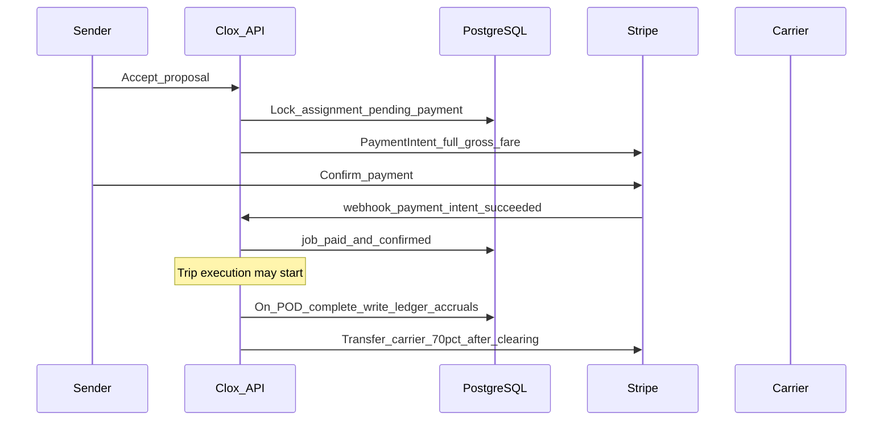

# Clox Payment & Settlement Specification (Stripe)

**Status:** Phase 1 canonical — **Stripe only** (Monoova deferred)  
**Currency:** AUD  
**Payment model (launch):** **Model A** — 100% pay on proposal accept  
**Related:** [BRD.md](../BRD.md) · [system-design.md](../system-design.md) · [thirdparty-integration.md](../thirdparty-integration.md) · [clox-platform-suite.md](../legal/clox-platform-suite.md) · [MILESTONES.md](../MILESTONES.md) (G0-1, G0-6, M7, M9, M12)

---

## 1. Purpose

Define how money moves through Clox using **Stripe Connect**:

- Collect sender fare (and surcharges)
- Hold funds until trip/settlement rules allow payout
- Pay carriers (~70% net)
- Accrue and pay admin shares (15% / 10% / 5%)
- Handle refunds, reversals, and breakdown reassignment

This document is the **source of truth for Phase 1 payment engineering**. Legal marketing that mentions Monoova NPP does not change Phase 1 implementation (see G0-6).

---

## 2. Locked product decisions

| Decision | Choice | Notes |
|----------|--------|-------|
| Collection rail | **Stripe** | Cards / AU payment methods via Stripe |
| Payout rail (pilot) | **Stripe Connect** | Carrier (+ admin) Transfers |
| Charge pattern (**G0-10**) | **Separate charges + transfers** | Platform PI → ledger → Transfer; not destination-charge-primary |
| GST (**G0-11**) | Charge **inc-GST total** cents | Persist ex_gst, gst, inc_gst; splits on **inc-GST gross** pending Finance written confirm |
| Monetization model | **Model A** | No deposit at publish; 100% at accept |
| Model B (deposit + balance) | **Out of Phase 1** | Spec retained below for later |
| Monoova NPP / PayTo | **Deferred (M12+)** | Optional cost optimization later |
| Platform fee | **30% of gross** | Carrier receives **~70%** |
| Admin split of gross | Super **15%** · State **10%** · Local **5%** | Attribution by **job origin** region/city |
| Carrier clearing | **7-day** clearing before withdraw/payout (product default) | Configurable policy |
| Admin payout cycle | Fortnightly **“4th night”** | Accrue on complete; disburse on cycle |
| Vacant territory | Unassigned State/Local share → **HQ / holding** | Configurable |

**Gate 0 ADR:** [adr/G0-gate-0-phase1-decisions.md](../adr/G0-gate-0-phase1-decisions.md)

---

## 3. Roles & Stripe entities

| Clox role | Stripe entity | Purpose |
|-----------|---------------|---------|
| Platform (Achieve Global / Clox HQ) | **Platform Stripe Account** | Charges, application fees, ledger orchestration |
| Sender | **Customer** + **PaymentMethod** | Pay fares & surcharges |
| Transport Company (Carrier) | **Connected Account** (Express recommended for Phase 1) | Receive 70% payouts |
| State Master / Local BDE | Connected Account **or** platform balance + manual/batch Transfer | Phase 1: prefer Connect if they receive automated payouts; else HQ holds until agreement |
| Driver | — | No direct Stripe payout in Phase 1 (paid by carrier) |

### Required Stripe products (must-have)

| Capability | Required | Used for |
|------------|:--------:|----------|
| Stripe Connect (AU) | Yes | Multi-party marketplace |
| Connected Accounts + Account Links | Yes | Carrier onboarding / bank KYC |
| Customers + PaymentMethods | Yes | Sender payment readiness |
| PaymentIntents | Yes | Full fare + surcharges |
| Destination charges **or** Separate charges & transfers | Yes | Collect then split |
| Webhooks | Yes | Authoritative money state |
| Transfers | Yes | Carrier (and admin) payouts |
| TransferReversals | Yes | Breakdown / reassignment |
| Refunds (full / partial) | Yes | Cancel, ACL, overpay |
| Idempotency keys | Yes | No double charge |
| Balance / BalanceTransactions (read) | Yes | Reconciliation |

### Optional (not blocking Phase 1 marketplace)

| Capability | When |
|------------|------|
| Stripe Radar | Fraud / dispute assist |
| Stripe Billing / Subscriptions | Fleet+ SaaS only |
| Stripe Invoicing / Tax | Optional; Clox can generate AU tax invoice PDFs in-app |
| Stripe Checkout | UX alternative; still PaymentIntents underneath |

---

## 4. Revenue split (ledger, not Stripe magic)

On **job completion** (gross fare + paid surcharges that belong to the job), Clox writes an internal ledger:

| Line | % of gross | Recipient |
|------|------------|-----------|
| Carrier net | ~70% | Transport Company Connected Account |
| Super Admin (HQ) | 15% | Platform / HQ |
| State Master | 10% | Regional admin for **origin state** (or HQ holding) |
| Local BDE | 5% | Local territory for **origin city** (or HQ holding) |

```
Gross sender charge (ex policy GST display rules)
  = Carrier transfer amount
  + Platform retained (30%)
      of which admin accruals: 15% + 10% + 5%
```

**Important:** Stripe moves cash; **Clox DB is source of truth** for who is owed what. Attribution uses **origin city/region of the load**, not “who onboarded the carrier.”

Admin net payout formula (business):

```
Net Admin Share = Gross Admin Share − (Management Fees + Pro-Rata Regional Marketing Deductions)
```

---

## 5. Recommended Connect charge pattern (Phase 1)

**Separate charges and transfers** (simplest for AU marketplace clarity):

1. Charge sender on the **platform** via `PaymentIntent` (`on_behalf_of` / Connect flags per Stripe AU docs as implemented).
2. Funds land on **platform balance**.
3. After clearing / completion rules → `Transfer` to carrier Connected Account for 70%.
4. Admin shares: Transfer on fortnightly job **or** retain on platform until Monoova later.

Alternative: **Destination charges** with `application_fee_amount` ≈ 30% — valid if finance prefers fee-at-charge-time. Pick one pattern in an ADR and do not mix per job.

**ADR recommendation (LOCKED G0-10):** Separate charges + transfers for Phase 1.

---

## 6. Lifecycle flows

### 6.1 Sender onboarding (payment ready)

1. Create Stripe **Customer** for sender.
2. Collect **PaymentMethod** (Payment Element / SetupIntent).
3. Sender reaches `sender_active` only when payment method ready (per [useronboarding.md](../useronboarding.md)).

### 6.2 Carrier onboarding (payout ready)

1. Create Connect **Account** (Express).
2. Send **Account Link** for KYC + bank details.
3. Persist `stripe_account_id`, `charges_enabled`, `payouts_enabled`.
4. Gate `approved_bid_eligible` (among other compliance) on payout profile verified.

### 6.3 Model A — Pay on accept (Phase 1 happy path)



**Rules**

- No PaymentIntent at job publish (Model A).
- Trip gates blocked until `paid_and_confirmed`.
- Persist `payment_intent_id`, amount, currency, status; never trust client alone.

### 6.4 Surcharges (mass discrepancy / waiting detention)

Triggered when:

- Declared mass exceeded at Gate B, or
- Free wait window exceeded (policy: e.g. 30 min pickup / 60 min drop)

**Flow**

1. Create surcharge record + block `StartTrip` (or continue per policy).
2. Create additional **PaymentIntent** for surcharge amount.
3. Notify sender; collect payment.
4. Webhook success → unlock gate / attach to job ledger.
5. Surcharge distribution follows same 70/30 policy unless finance defines otherwise (default: same split).

### 6.5 Carrier settlement

| Step | Behaviour |
|------|-----------|
| Accrual | On trip `completed` + POD locked |
| Clearing | Hold **7 days** (default) subject to disputes |
| Payout | `Transfer` to carrier Connected Account |
| Visibility | Carrier UI shows **net 70%** only on job board; wallet shows available vs pending |

### 6.6 Admin settlement (fortnightly)

1. Rolling 14-day window closes.
2. Sum accruals by admin scope (origin attribution).
3. Apply management/marketing deductions.
4. Disburse via Stripe Transfer (Phase 1) on **4th night** schedule.
5. Super Admin finance UI reconciles mismatches.

### 6.7 Breakdown / cancel / reassignment

| Scenario | Stripe actions |
|----------|----------------|
| Internal replacement (same carrier) | Usually **no** money move; update assignment |
| Release to marketplace / new carrier | **TransferReversal** (if already transferred) + new Transfer; or hold on platform until re-award |
| Cancel / ACL major failure | **Refund** to sender per policy |
| Sender rejects replacement | Cancel + refund path |

Escrow conceptually = funds on **platform balance** until rules release them — not a separate Stripe product.

### 6.8 Model B — Deposit + balance (deferred)

Documented for future only. Do **not** implement in Phase 1 unless G0-1 is reopened.

- PI_A deposit before open-for-bids  
- PI_B balance at accept  
- Partial refund if final &lt; deposit  

See [system-design.md](../system-design.md) §2.4.

---

## 7. Internal payment state machine (illustrative)

### Job payment states (Model A)

```text
unpublished / draft
  → published                    (no charge)
  → assigned_pending_payment     (accept; PI created)
  → paid_and_confirmed           (webhook succeeded)
  → completed_settlement_pending (POD done; ledger written)
  → carrier_transfer_pending
  → carrier_paid
  → closed

Branches:
  payment_failed | requires_action
  cancelled_refunded
  disputed_hold
```

### Surcharge states

```text
surcharge_pending → surcharge_requires_payment → surcharge_paid
                 ↘ surcharge_disputed / waived_by_ops
```

Persist every transition with actor, timestamp, Stripe event id.

---

## 8. Webhooks (mandatory)

Endpoint: `POST /internal/stripe/webhook` (signature verified).

| Event family | Action |
|--------------|--------|
| `payment_intent.succeeded` | Mark fare/surcharge paid; unlock job/trip |
| `payment_intent.payment_failed` | Fail state; notify sender; no trip start |
| `payment_intent.requires_action` | Surface SCA to client |
| `charge.refunded` / `refund.*` | Sync refund ledger |
| `transfer.created` / `updated` / `failed` | Carrier/admin payout status |
| `transfer.reversed` | Reassignment accounting |
| `account.updated` | Carrier Connect readiness flags |
| `capability.updated` | Payouts/charges enabled changes |

**Rules**

- Store `stripe_event_id` **UNIQUE** — retries are no-ops.
- All payment mutations idempotent.
- Cron reconciliation compares Stripe vs DB daily.

---

## 9. Data model (minimum fields)

| Entity | Key fields |
|--------|------------|
| `SenderPaymentProfile` | `stripe_customer_id`, default PM id, status |
| `CarrierPayoutProfile` | `stripe_account_id`, `payouts_enabled`, onboarding status |
| `PaymentEvent` | job_id, type (`full_fare`\|`surcharge`\|`refund`\|`transfer`\|…), amount, currency, stripe_object_id, status |
| `SettlementLine` | job_id, beneficiary_type (`carrier`\|`super`\|`state`\|`local`), amount, origin_region, origin_territory, cycle_id |
| `SettlementCycle` | period_start/end, status, disbursed_at |

Never store raw card numbers. PCI scope stays with Stripe.

---

## 10. API surface (illustrative)

| Endpoint | Purpose |
|----------|---------|
| `POST /v1/sender/payment/setup` | SetupIntent / attach PM |
| `POST /v1/transport-company/payout/setup` | Connect Account Link |
| `POST /v1/jobs/{id}/proposals/{id}/accept` | Lock assignment + create fare PaymentIntent |
| `POST /v1/jobs/{id}/surcharges` | Create surcharge + PI |
| `POST /internal/stripe/webhook` | Provider events |
| `POST /v1/ops/settlements/run` | Super-triggered or cron fortnightly cycle |
| `GET /v1/finance/reconcile` | Ops mismatch view |

---

## 11. Security & compliance

- TLS only; secrets in vault; rotate restricted keys.
- Step-up / audit for payout destination changes and manual refunds.
- Idempotency on every charge/transfer/refund.
- AU tax invoice PDF (≥ $1,000 include sender name/address) generated by Clox; Stripe is the payment rail.
- No raw PAN in Clox logs.

---

## 12. Phase plan

| Milestone | Payment work |
|-----------|--------------|
| **M3** | Sender Customer + PaymentMethod |
| **M4** | Carrier Connect onboarding |
| **M7** | Accept → PaymentIntent; webhook state machine |
| **M9** | Surcharge PaymentIntents (mass / wait) |
| **M12** | Carrier Transfers, reconciliation, admin accrual UI; Monoova still optional |

**Out of Phase 1:** Monoova NPP primary rail, Model B deposits, Fleet+ subscription billing (unless explicitly scoped).

---

## 13. Acceptance criteria

- [ ] Sender cannot reach booking-active without payment method ready  
- [ ] Carrier cannot become bid-eligible without Connect payout readiness (plus compliance)  
- [ ] Accept creates exactly one primary fare PaymentIntent (idempotent)  
- [ ] Trip cannot start until fare webhook success  
- [ ] Mass/wait surcharge blocks gate until paid or waived by Ops policy  
- [ ] Carrier Transfer equals ledger 70% after clearing (within rounding policy)  
- [ ] Admin accruals 15/10/5 by origin; vacant → HQ holding  
- [ ] Refund / TransferReversal paths covered for cancel & breakdown market release  
- [ ] Webhook dedupe + daily reconcile job green in staging  

---

## 14. Open finance questions (record in ADR if changed)

1. Destination charge + application fee **vs** separate charge + transfer (recommend separate).  
2. Do surcharges split 70/30 same as base fare? (default **yes**)  
3. GST presentation: prices ex-GST vs inc-GST in PaymentIntent amount.  
4. Exact clearing days (7) and dispute hold extension.  
5. Whether State/Local get Connect accounts in pilot or HQ pays offline initially.
