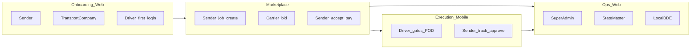

# Clox — Role-Based Screen Flows (Index)

Screen-flow documentation for each platform role. Derived from [PRD](../PRD.md), [BRD](../BRD.md), [useronboarding](../useronboarding.md), [transportcompanyonboarding](../transportcompanyonboarding.md), and [system-design](../system-design.md).

**Lifecycle reference:** [Sender and Carrier Job diagram](../../Sender%20and%20Carrier%20Job-2026-05-14-024513.png) · [basic-flow-visual](../basic-flow-visual.md)

---

## Role index

| Role | File | Platform | Scope |
|------|------|----------|--------|
| Super Admin (HQ) | [super-admin.md](super-admin.md) | Web — Ops portal | National governance, policy, full override |
| State Master Admin | [state-master-admin.md](state-master-admin.md) | Web — Ops portal | State/territory filter |
| Local BDE Admin | [local-bde-admin.md](local-bde-admin.md) | Web — Ops portal | Local territory, growth & first-line support |
| Transport Company | [transport-company.md](transport-company.md) | Web | Onboarding, fleet, bidding |
| Sender | [sender.md](sender.md) | Web + Mobile | Onboarding & booking (web); track & approvals (mobile) |
| Driver | [driver.md](driver.md) | Web (invite) + Mobile | Profile setup (web); trip execution (mobile) |

**Channel policy (Phase 1):** Onboarding/signup/verification on **web** for customer-facing roles. Sender and Driver **mobile apps** are login + operational flows only ([useronboarding](../useronboarding.md)).

---

## Platform matrix

| Capability | Super | State | Local BDE | Transport Co. | Sender | Driver |
|------------|:-----:|:-----:|:---------:|:-------------:|:------:|:------:|
| Web portal | Yes | Yes | Yes | Yes | Yes | Invite only |
| Mobile app | — | — | — | — | Yes | Yes |
| Self-service signup | No | No | No | Yes | Yes | Via invite |
| Create jobs | — | — | — | — | Yes | — |
| Submit bids | — | — | — | Yes | — | — |
| Trip execution gates | — | — | — | — | — | Yes |
| Compliance approve | Yes | State | Local* | — | — | — |
| Policy / tariff edit | Yes | — | — | — | — | — |

\*Local BDE approve rights are policy-configurable; default is view + comment, escalate to State.

---

## Lifecycle overlay

Phases from the end-to-end job diagram mapped to role touchpoints:



---

## Admin tier comparison

| Capability | Super Admin | State Master | Local BDE |
|------------|:-----------:|:------------:|:---------:|
| National dashboard | Yes | No | No |
| Policy / tariff edit | Yes | No | No |
| Provision admins | Yes | Local only* | No |
| Compliance approve | Yes (all regions) | State-scoped | Local-scoped* |
| Dispute final ruling | Yes | State | First-line |
| Revenue / settlement detail | Full | State share (10%) | Local share (5%) |

\*Configurable per deployment policy; defaults follow least privilege ([security](../security.md)).

Revenue split reference: [BRD](../BRD.md) — Super 15%, State 10%, Local 5% of gross platform share.

---

## Wireframe document format

Each role file follows the **flow + connected screens** pattern (reference: mobile wireframe PDF — multi-screen rows, numbered steps, status-bar mockups).

| Element | Mobile (Sender, Driver) | Web (Ops, Carrier) |
|---------|-------------------------|---------------------|
| Frame | iPhone-style (`9:41`, bottom tabs) | Ops portal (sidebar + main) |
| Flow header | `## FLOW 01: Onboarding` | Same |
| Screen row | `Screen A ──► Screen B ──► Screen C` | Same (wider frames) |
| Steps | Numbered list under each flow | Same |
| States | Success / Pending / Failed variants where relevant | Queue states, approve/reject |

**Design tokens (Phase 1 spec — align UI build):**

- Primary CTA: full-width, bottom-fixed on mobile
- Cards: rounded, list rows with status pills (green verified, amber pending, red failed)
- Progress: step dots on multi-step onboarding
- Bottom nav (mobile ops): Home · Track · Approvals · Account

---

## Conventions

### Screen ID format

`{ROLE}-{AREA}-{NN}`

| Prefix | Role |
|--------|------|
| `OPS-SUP` | Super Admin |
| `OPS-STA` | State Master Admin |
| `OPS-LOC` | Local BDE Admin |
| `TCO` | Transport Company |
| `SND` | Sender |
| `DRV` | Driver |
| `SHR` | Shared (all roles) |

### ASCII wireframe pattern

```
┌─────────────────────────────────────┐
│ [←]  Screen Title          [•••]   │
├─────────────────────────────────────┤
│  [Primary content area]             │
│  [Field labels / lists / maps]      │
├─────────────────────────────────────┤
│  [Secondary action]  [PRIMARY CTA] │
└─────────────────────────────────────┘
```

### State-gated UI

Screens marked **Gated** in role files hide or disable until backend account/job/trip state allows the action. Client must not trust local flags for payment or trip-start gates ([system-design](../system-design.md) §2.8).

---

## Shared screens

Documented once; referenced by ID in role files. Layout matches **flow + connected mockups** style (see role files).

### SHR-AUTH — Login & OTP (all roles)

`SHR-AUTH-01` ──► `SHR-AUTH-02`

```
┌──────────────────────┐     ┌──────────────────────┐
│ 9:41            🔋   │     │ 9:41            🔋   │
├──────────────────────┤     ├──────────────────────┤
│      [Clox]          │     │ ←  Verify code       │
│ Email or mobile      │     │ Sent to •••• 1234    │
│ [________________]   │     │ [_][_][_][_][_][_]   │
│                      │     │ Resend in 0:45       │
│ [   Send OTP  →   ]  │     │ [    Verify     ]    │
│ Sign up (role link)  │     │                      │
└──────────────────────┘     └──────────────────────┘
```

**Exit:** Role dashboard or onboarding entry.

### SHR-NOTIF-01 — Notifications inbox

```
┌─────────────────────────────────────┐
│  Notifications              [Mark all read] │
├─────────────────────────────────────┤
│  ● Compliance doc expiring — Acme   │
│    2h ago                           │
│  ○ Proposal accepted — Job #1042  │
│    Yesterday                        │
└─────────────────────────────────────┘
```

### SHR-PROF-01 — Profile & security

```
┌─────────────────────────────────────┐
│ [←]  Account                        │
├─────────────────────────────────────┤
│  Name, email, phone                 │
│  Sessions & devices                 │
│  Notification preferences           │
│  Sign out                           │
└─────────────────────────────────────┘
```

---

## Related documentation

- [MILESTONES](../MILESTONES.md) — Phase 1 program milestones & release trains
- [MILESTONES-AUSTRALIA](../MILESTONES-AUSTRALIA.md) — Australia-only milestone list (Gate 0 + M0–M12)
- [PRD](../PRD.md) — functional requirements
- [BRD](../BRD.md) — business rules & revenue
- [security](../security.md) — RBAC baseline
- [useronboarding](../useronboarding.md) — sender & driver states
- [transportcompanyonboarding](../transportcompanyonboarding.md) — carrier states
- [system-design](../system-design.md) — trip & payment flows
