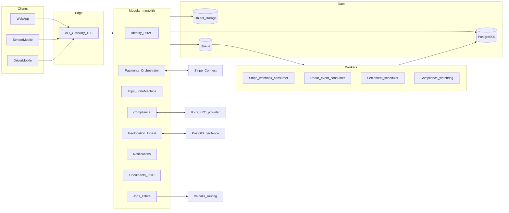
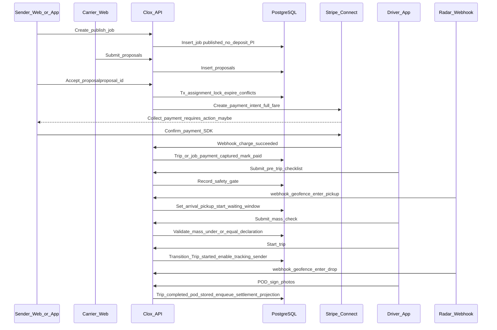
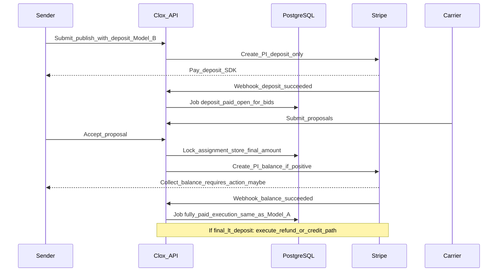
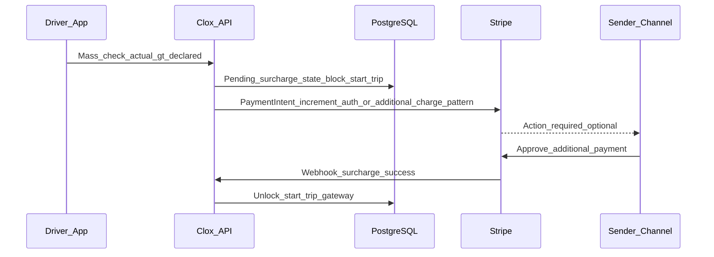
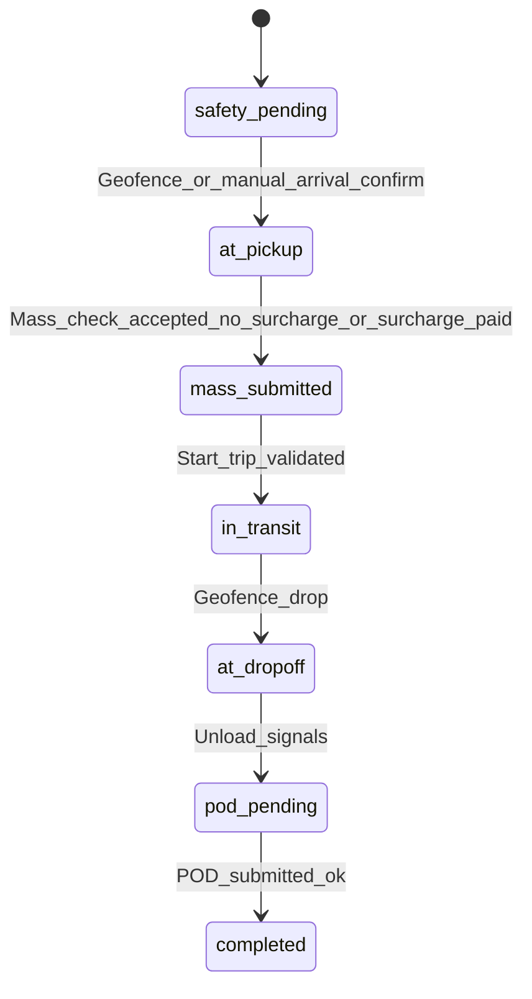

# Clox — System Design (Overview + End-to-End Flow A)

Audience: TPM, architects, backend/mobile/web leads.

Related: [PRD.md](PRD.md) · [BRD.md](BRD.md) · [basic-workflow.md](basic-workflow.md) · [thirdparty-integration.md](thirdparty-integration.md) · [payments/stripe-payment-specification.md](payments/stripe-payment-specification.md) · [security.md](security.md) · [useronboarding.md](useronboarding.md)

---

## 1. Architecture choices (Phase 1)

### 1.1 Recommended shape

| Layer | Recommendation |
|-------|----------------|
| Backend | **Modular monolith** — one deployable, **bounded contexts** as Nest modules; designed to extract into **microservices later** without rewrite — see [architecture/backend-architecture.md](architecture/backend-architecture.md) |
| Sync vs async | **Transactional APIs** for money, assignment, trip gates; **queue + workers** for webhooks, notifications, reconciliation, scheduled jobs |
| Microservices | **Defer** until team size/load forces a split (candidates later: payouts/workers, Fleet+ analytics) |
| Event style | **Domain events internally** (+ outbox); not “everything async” |

### 1.2 Bounded contexts (modules)

- **Identity / Auth / RBAC**
- **Compliance** (KYB/KYC orchestration, document metadata, accreditation flags)
- **Jobs & RFQ** (create job, broadcast, bid lifecycle)
- **Matching** (vehicle recommendation rules, overlap-based bid expiry — rules first, ML-assisted ETA later per [ai-integration.md](ai-integration.md))
- **Trips** (state machine, gates, POD)
- **Payments** (Stripe Connect orchestration, idempotency, internal payment state ledger references)
- **Notifications** (email/push/SMS abstraction)
- **Geolocation ingest** (Radar webhooks/events → dwell, arrival timestamps)
- **Documents & media** (KYC blobs, POD, signed URLs)

### 1.3 Client topology

- **Web:** onboarding, carrier ops, admin, optional sender booking.
- **Mobile:** Sender (track, approvals), Driver (execution, POD).
- **BFF:** optional if web/mobile contract divergence grows; Phase 1 can use single versioned REST API.

### 1.4 Data stores

| Store | Role |
|-------|------|
| PostgreSQL | System of record: users, orgs, jobs, proposals, trips, compliance refs, payout refs |
| Object storage | KYC docs, POD images; DB holds metadata + hashes |
| Redis (optional) | Sessions, rate limits, idempotency keys, short-lived locks (use with caution) |
| Queue | Stripe/Radar/async jobs, outbound notification fan-out |

### 1.5 Third parties (summarized)

Stripe Connect (capture, incremental auth where needed), Radar (geofence/dwell), Google Routes/Maps (routing, sequencing), KYB/KYC provider, Monoova deferred or parallel to Stripe payouts per policy ([thirdparty-integration.md](thirdparty-integration.md)).

### 1.6 High-level component view

> Phase 1: KYB/KYC is manual Ops (no AML provider in diagram). Geofence = PostGIS; routing = Valhalla. Radar/Monoova/easyAML deferred.
---

## 2. Deep dive A — End-to-end request flow

**Scope:** Sender creates job → carriers bid → sender accepts proposal → **100% Stripe payment** → trip gates (safety → arrival → mass check → trip start → tracking) → POD → settlement references.

Assumptions: users already **web-onboarded** and carriers **bid-eligible**. Hourly vs per-km and multi-stop only affect routing payload, not core money/trip skeleton.

---

### 2.1 Canonical entities (mental model)

- `Job` / `ShipmentRequest` — what sender asked for (price mode, lanes, cargo, suitability).
- `Proposal` / `Bid` — carrier submission (vehicle ref, driver ref, ETA, price offer where applicable).
- `Assignment` — winning proposal locks vehicle + driver.
- `Trip` — execution record with strict state machine and links to Stripe payment intents/charges where relevant.

---

### 2.1b Two distinct monetization models (do not mix per job)

Clox can support **either** model as a **product-level or per-tenant policy**, but a **single job** should follow **one** path end-to-end so accounting, webhooks, and reversals stay deterministic.

| Dimension | **Model A — Pay on accept** | **Model B — Deposit on publish** |
|-----------|-----------------------------|----------------------------------|
| **First money movement** | None at publish; carriers bid with no sender funds held by platform (beyond optional saved card for faster checkout). | **Deposit** captured (or authorized then captured per policy) **before or as part of** transition to an “open for bids” state. |
| **Full fare collection** | **100% at proposal accept** (agreed price). | **Balance** at accept: `final_agreed_amount - deposit_captured` (plus handling if final &lt; deposit). |
| **Sender psychology** | Lower friction to post a job; higher risk of payment drop-off after award. | Higher commitment; may improve bid quality and reduce ghost jobs. |
| **Carrier trust** | Depends on payment success right after accept. | Deposit signals seriousness before carriers invest time. |
| **Implementation complexity** | Lower (one primary PI per job + surcharges). | Higher (deposit PI, balance PI, refunds/credits, expiry rules). |
| **Stripe artifacts** | Typically one `PaymentIntent` for full fare at accept (+ incrementals for discrepancy/dwell). | Minimum `deposit_payment_intent` + `balance_payment_intent` (or credit/refund path). |

Record on each job: `payment_model = A | B` at creation (immutable unless admin migrates draft jobs).

---

### 2.2 Model A — Pay on proposal accept (no deposit at publish)

**Numbered happy path**

1. **Sender: create & publish job**  
   Persist job as `draft` → **`published`** (broadcast) once validation passes (min fare, DG rules, routing for hourly). **No platform payment intent required** for publication.

2. **Carrier: submit proposals**  
   Each proposal validates vehicle class, licences, overlaps (non-award conflicting bids untouched until award).

3. **Sender: accept one proposal**  
   Transaction: mark chosen proposal **accepted**, others **withdrawn/expired-by-policy**, create `Assignment`, job → **`assigned_pending_payment`** → becomes **`paid_and_confirmed`** after step 4 success. Run overlap-based expiry for same vehicle/driver.

4. **Payment: full fare at accept**  
   Create **`PaymentIntent` for agreed gross fare** (Stripe Connect pattern per governance). Sender completes payment; webhook **`charge succeeded`** → **`paid_and_confirmed`**. Until then: **trip execution cannot start**.

5. **Driver: safety gate**  
   App submits pre-trip checklist → trip `phase_pre_trip_ok`.

6. **Geofence: arrival pickup**  
   Radar (or equivalent) signals enter polygon → server records `arrival_pickup_at`, starts **wait timer**.

7. **Mass check Gate B**  
   Driver submits mass + restraint affirmation.  
   - If mass ≤ declared: unlock next.  
   - If mass > declared: create **incremental authorization** / surcharge invoice path; **`StartTrip` stays disabled** until sender payment or approval per policy.

8. **Start trip**  
   Server verifies: paid, assignment active, gates passed → `Trip_Started`; **tracking visible to sender** from this moment (matches product rule).

9. **En route & drop geofence**  
   Duplicate pattern: arrival drop, optional wait, **deliver**.

10. **POD**  
    Sign-on-glass + photos; server attaches **immutable timestamp** (+ GPS metadata). Trip → `completed`.

11. **Post-complete**  
    Generate invoice artifact, enqueue settlement schedule (carrier net, admin shares per fortnightly policy).

---

### 2.3 Model A — Sequence diagram (pay on accept; no charge at publish)

---

### 2.4 Model B — Deposit on publish + balance on accept

**Intent:** Sender pays a **non-zero deposit** when the job enters a **marketplace-visible** state; on **accept**, the platform collects the **remainder** of the agreed fare (or issues **refund/credit** if deposit exceeds final). **Separate lifecycle from Model A** — persist `payment_model = B` on the job.

**Suggested job payment states (illustrative)**

- `draft` → `awaiting_deposit` → **`deposit_paid_open_for_bids`** → proposals…  
- On accept: `accept_pending_balance` → **`fully_paid`** after balance succeeds → same trip execution gates as Model A.  
- Terminal: `cancelled_refund_deposit` / `expired_no_bids` per policy.

**Deposit amount (policy)**

- Fixed amount or **percentage of indicative quote** / max of published range, with min/max caps.  
- Persist `deposit_amount_aud`, `deposit_payment_intent_id`, `deposit_captured_at`.

**Balance at accept**

- `final_agreed_amount` from accepted proposal (gross sender charge).  
- `balance_due = max(0, final_agreed_amount - deposit_already_captured)`.  
- If `final_agreed_amount < deposit_already_captured`: **partial refund** or **customer balance credit** (explicit finance + Stripe policy).

**Stripe (typical pattern)**

1. **Deposit:** `PaymentIntent` A for deposit; capture before opening bids (or auth-then-capture if you choose).  
2. **Balance:** `PaymentIntent` B for `balance_due` at accept.  
3. **Surcharges** (mass/dwell): same incremental pattern as Model A, after `fully_paid` baseline is clear.

**Operational rules (document in BRD/commerce)**

| Event | Model B behavior |
|-------|------------------|
| Sender cancels before accept | Refund deposit minus fee (optional). |
| No award by expiry | Auto-close + refund deposit per policy. |
| Accept then balance fails | Hold assignment in `pending_payment`; no trip start. |

**Accounting note:** Align with finance whether deposit is **recognized** at capture or held as **customer liability** until job completion (affects admin revenue reports).

**Sequence diagram (conceptual)**

---

### 2.5 Mass discrepancy branch (minimal)

---

### 2.6 API endpoints (illustrative)

| Step | Example | Notes |
|------|---------|-------|
| Publish job (Model A) | `POST /v1/jobs` | `payment_model=A`; no deposit |
| Publish job (Model B) | `POST /v1/jobs` or `POST /v1/jobs/:id/pay-deposit` | Create or confirm deposit PI before `open_for_bids` |
| List proposals | `GET /v1/jobs/:id/proposals` | Masking per BRD |
| Accept (Model A) | `POST /v1/jobs/:id/accept` | Full-fare PI follows |
| Accept (Model B) | `POST /v1/jobs/:id/accept` | Balance PI follows; may be `balance_due = 0` |
| Stripe webhooks | `POST /internal/stripe/webhook` | Tag event to `deposit` vs `balance` vs `full_fare` vs `surcharge` |
| Safety | `POST /v1/trips/:id/safety-check` | |
| Mass | `POST /v1/trips/:id/mass-check` | |
| Start trip | `POST /v1/trips/:id/start` | Server-side only after gates + **fully_paid** (definition differs by model but gate is same name) |
| POD | `POST /v1/trips/:id/pod` multipart | Virus scan + metadata |
| Radar | `POST /internal/radar/webhook` | Auth between Radar and backend |

Exact paths are product naming; versioning required.

---

### 2.7 Trip state machine (execution slice)

States (example names — align naming in codebase):

`safety_pending` → `at_pickup` (geo) → `loading` → `mass_submitted` → `in_transit` → `at_dropoff` → `unloading` → `pod_pending` → `completed`

Hard rule: **`in_transit` not entered** until mass gate + payment rules satisfied.

---

### 2.8 Consistency & idempotency rules

- **Accept proposal:** DB transaction updates job + proposals exactly once; use unique constraint `(job_id, status=accepted)` or equivalent row lock.
- **Stripe webhook:** persist `stripe_event_id` UNIQUE; retries become no-op.
- **Model B deposit:** `deposit_payment_intent_id` UNIQUE per job; webhook must not double-open bids.
- **Model B balance:** `balance_payment_intent_id` UNIQUE per assignment; if `balance_due = 0`, skip PI creation and transition state explicitly.
- **Start trip:** idempotency key from client; server recomputes boolean gate from canonical DB state — never trust client flags alone.
- **Geofencing:** ingest may arrive out of order — store raw events then derive trip transitions with deterministic rules.

---

### 2.9 Failure modes (operations)

| Failure | Desired behavior |
|---------|-------------------|
| Payment fails after accept (Model A) | Assignment `payment_failed`; SLA to release or expire bids |
| Payment fails after accept (Model B balance) | Remain `accept_pending_balance`; no trip start; clarify partial capture vs forfeiture policy if sender abandons |
| Deposit fails on publish (Model B) | Job stays `awaiting_deposit`; not visible to carriers (or partial visibility forbidden) |
| Webhook delayed | Cron reconciliation job compares Stripe dashboard vs DB |
| Driver starts trip offline | Offline queue on mobile risky for money — prefer online-only Start Trip or pessimistic UX |
| Double Start Trip | Ignore second call (idempotent 200 / 409 semantics agreed in API guide) |

---

## 3. Next deep-dive sections (TODO in follow-up chats)

- **B:** When to split Payments or Fleet+ into separate services  
- **C:** Relational schema sketch (tables per context)  
- **D:** API style (REST v1 conventions, versioning, mobile contract)
