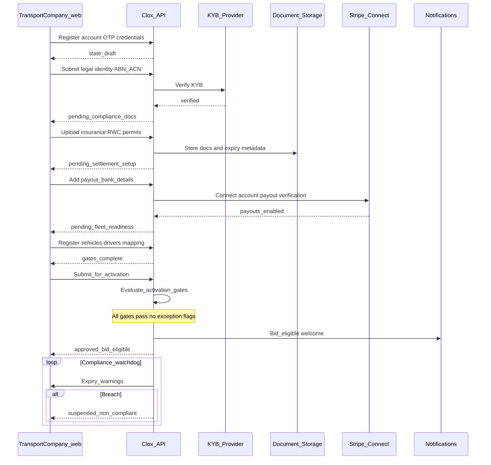
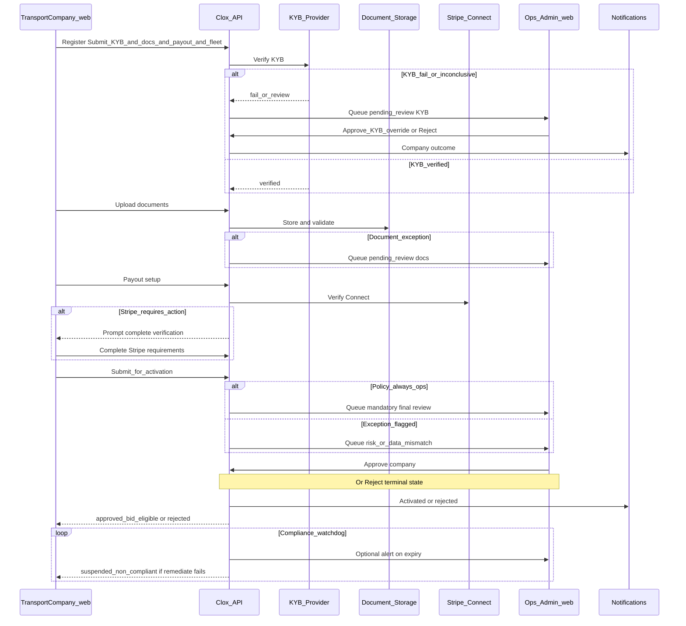

# Transport Company Onboarding - Sequence Diagrams

Visual companion to [transportcompanyonboarding.md](transportcompanyonboarding.md). **Web-first (Phase 1).** Two variants: **automatic activation** when all gates pass, and **Ops-gated activation** for manual intervention or policy.

## Configuration (product policy)

- **Auto path:** Use when `automated_gates_all_pass` and no risk/manual-review flags (e.g., KYB verified, documents valid, Stripe payout verified, min one compliant vehicle + driver).
- **Ops path:** Use when policy requires human sign-off for all new carriers, or when any gate is inconclusive, KYB fails, document mismatch, Stripe `requires_action`, or fraud/risk score exceeds threshold.
- **Hybrid (recommended):** Default to auto when clean; route to Ops whenever any exception applies.

---

## 1) Auto-approved activation (no Ops step on success)

---

## 2) Ops-approved activation (manual intervention)

---

## Notes

- **KYB / Stripe / documents** can enter Ops at multiple points; diagram 2 collapses early steps for readability while showing the decision pattern.
- **Monoova** outbound payouts are optional and not required to complete onboarding activation; add when settlement policy uses NPP/Osko (see [thirdparty-integration.md](thirdparty-integration.md)).
- **Notifications:** single logical actor; channel mix is product/ops policy.
