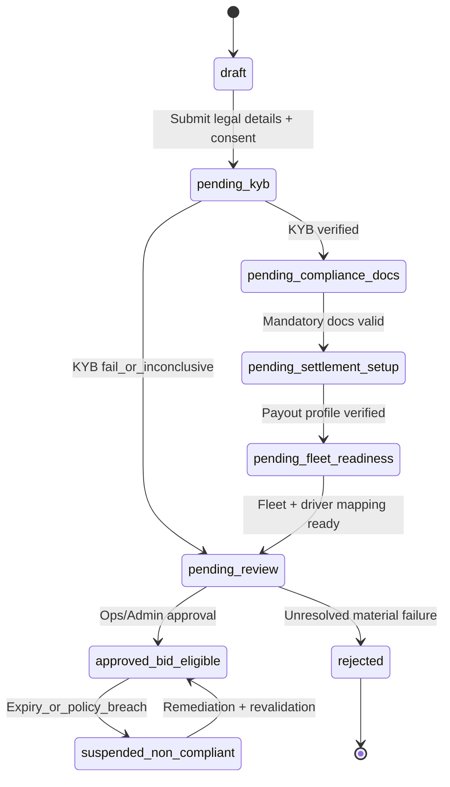

# Transport Company Onboarding - Workflow and State Machine

## Objective
Define an implementation-ready onboarding flow for transport companies, including compliance gating, settlement setup, fleet readiness, and bid eligibility.

Related: [Sequence diagrams — auto-approved + Ops-approved](transportcompanyonboarding-sequence.md) · [User onboarding (Sender + Driver)](useronboarding.md)

## Channel Policy
- Onboarding channel: Web only (Phase 1).
- Post-onboarding operations: Web primary; mobile companion optional in later phases.

## State Machine

### States
- `draft`
- `pending_kyb`
- `pending_compliance_docs`
- `pending_settlement_setup`
- `pending_fleet_readiness`
- `pending_review`
- `approved_bid_eligible`
- `suspended_non_compliant`
- `rejected`

### Transition Rules
- `draft -> pending_kyb`
  - Trigger: company submits legal entity details (ABN/ACN) and accepts terms.
- `pending_kyb -> pending_compliance_docs`
  - Trigger: KYB success via provider.
- `pending_kyb -> pending_review`
  - Trigger: KYB inconclusive/fail requiring manual intervention.
- `pending_compliance_docs -> pending_settlement_setup`
  - Trigger: mandatory documents uploaded and parsed with valid expiry dates.
- `pending_settlement_setup -> pending_fleet_readiness`
  - Trigger: payout profile and bank rail verification complete.
- `pending_fleet_readiness -> pending_review`
  - Trigger: minimum one compliant vehicle and one licensed driver mapped.
- `pending_review -> approved_bid_eligible`
  - Trigger: operations/admin approval passed.
- `pending_review -> rejected`
  - Trigger: material compliance failure not remediated within SLA.
- `approved_bid_eligible -> suspended_non_compliant`
  - Trigger: expired insurance/RWC/permits, failed audits, payout account invalidation, or policy breach.
- `suspended_non_compliant -> approved_bid_eligible`
  - Trigger: remediation complete and revalidation passed.

## Step-by-Step Onboarding Flow

1. **Account Registration**
- OTP/email signup, credential setup, legal consent capture.

2. **Legal Entity and KYB (Phase 1 — manual)**
- Submit company legal name, ABN, ACN, address, contact person.
- Optional ABR active-status lookup to assist Ops.
- Upload supporting identity/company docs as required.
- **Ops/State Master** verifies manually (no easyAML/Trulioo in Phase 1).
- Route all new carriers to compliance review queue (default).

3. **Compliance Document Upload**
- Mandatory uploads:
  - Public Liability Insurance
  - Transit/Cargo Insurance
  - Vehicle RWCs
  - Required permits (e.g., DG, oversize where applicable)
- Store document metadata:
  - issue date
  - expiry date
  - insurer/policy reference
  - verification status

4. **Settlement and Financial Setup**
- Add payout account details and beneficiary details.
- Validate payout profile (Stripe and/or Monoova policy path).
- Confirm tax and remittance preferences.

5. **Fleet Registration**
- Per vehicle capture:
  - registration number
  - vehicle class
  - GVM/GCM
  - tare/load attributes
  - RWC expiry
- Fleet+ optional fields:
  - cost per km
  - service interval
  - fuel type

6. **Driver Setup and Mapping**
- Add driver identities and license classes.
- Link driver-to-vehicle eligibility.
- Enforce role and compliance checks.

7. **Service Capability Declaration**
- Declare operating regions and load capabilities.
- Enable special handling capabilities (DG, reefer, crane, container, etc.).

8. **Final Validation Gate**
- Required checks:
  - KYB pass
  - mandatory docs valid and unexpired
  - payout setup verified
  - at least one active compliant vehicle-driver pair
- If pass -> move to bid eligible.

## Validation Checklist (Go/No-Go)
- `kyb_status == verified`
- `insurance_status == valid`
- `rwc_status == valid`
- `payout_profile == verified`
- `fleet_count_active >= 1`
- `driver_count_active >= 1`
- `vehicle_driver_mapping_valid == true`

## Ongoing Compliance Watchdog
- Daily/near-real-time monitors:
  - document expiries
  - RWC expiry
  - permit validity
  - payout rail validity
- Automatic action:
  - move account to `suspended_non_compliant`
  - disable bidding and new assignment actions
  - notify transport admin and platform ops

## API-Oriented Reference (Suggested)
- `POST /v1/transport-company/register`
- `POST /v1/transport-company/kyb/verify`
- `POST /v1/transport-company/documents/upload`
- `POST /v1/transport-company/payout/setup`
- `POST /v1/fleet/register`
- `POST /v1/driver/register`
- `POST /v1/transport-company/submit-for-review`
- `POST /v1/transport-company/approve`
- `POST /v1/transport-company/suspend`
- `POST /v1/transport-company/reactivate`

## Notes for Phaseing
- Phase 1:
  - strict web onboarding, manual review fallback, core compliance gate.
- Phase 2:
  - enhanced automation for document parsing and risk scoring,
  - Fleet+ analytics tied to onboarding completeness quality.
