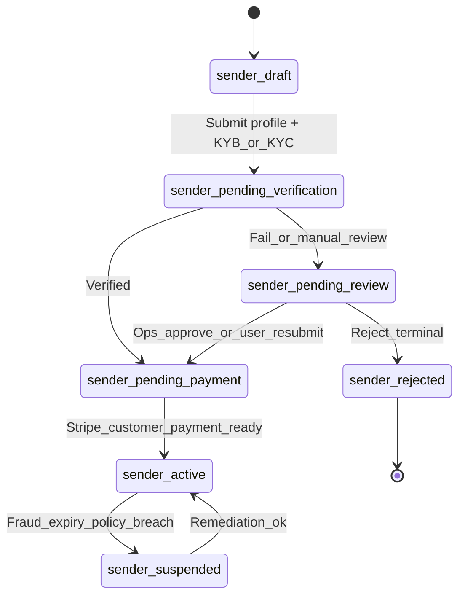
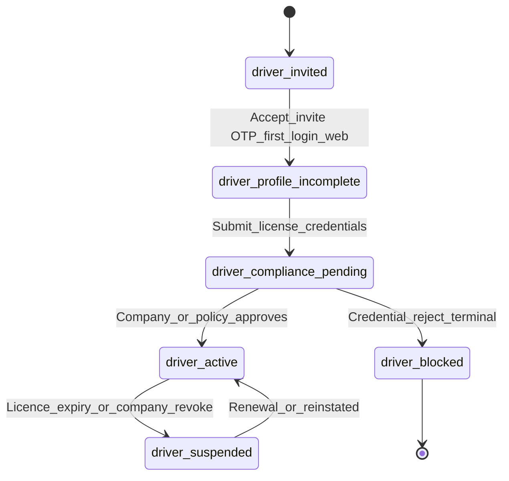

# User Onboarding - Clox Web-First (Phase 1)

## Channel policy (agreed direction)

- **Onboarding / signup / verification:** Web only for all customer-facing roles (Phase 1).
- **Sender and Driver apps:** Login and operational flows only; no full KYC/KYB repeat in app unless you add Phase 2 lite flows.

Related: [Transport company onboarding](transportcompanyonboarding.md) | [Transport company sequence (auto + Ops)](transportcompanyonboarding-sequence.md)

---

## 1) Sender (Customer) onboarding

### Paths

- **Business sender:** ABN/ACN + KYB.
- **Individual sender:** Government ID + KYC (and liveness where provider requires).

### State machine

### Step-by-step

1. **Registration** — Email/phone, OTP, credential setup, Terms & Privacy.
2. **Account type** — Business vs Individual branch.
3. **Verification (Phase 1 — manual)**
   - Business: entity details + ABN/ACN (+ supporting uploads) → Ops compliance queue.
   - Individual: government ID upload → Ops compliance queue.
   - Optional: ABR free ABN status shown to Ops (not auto-approve).
   - **No easyAML/Trulioo in Phase 1.**
   - Ops Approve → continue; Request info / Reject as needed.
4. **Invoice profile** — Legal name, AU address, GST flags for invoicing compliance (business rules ≥ threshold per product policy).
5. **Payment prerequisites** — Stripe customer + default payment method as required before first booking.
6. **Activation** — `sender_active` → can create jobs / accept proposals per product rules.

### Go/no-go checklist (booking enabled)

| Check | Sender business | Sender individual |
|-------|-----------------|-------------------|
| KYB / KYC | Ops verified (manual) | Ops verified (manual) |
| Invoice fields | complete | complete |
| Payment | ready | ready |
| Account state | active | active |

---

## 2) Driver onboarding

Drivers are anchored to a **Transport Company**. Phase 1 assumes **carrier-initiated** setup on web/admin; driver uses app **after** credentials exist.

### State machine

### Step-by-step

1. **Create / invite** — Transport company adds driver (email or phone); system sends invite.
2. **First access (web)** — OTP, password, accept policies and safety acknowledgement (NHVR-related copy per legal).
3. **Credentials** — Licence class, licence number, expiry, optional endorsements; document photo if policy requires.
4. **Linkage** — Driver bound to exactly one primary company context for assignment (unless you later allow multi-fleet apps).
5. **Activation** — `driver_active` → eligible for allocation on bids that pass vehicle + licence validation.
6. **App only** — Install driver app → login → trip execution (safety checklist, mass check, POD).

### Fatigue (Phase 1)

- Manual work diary offline; optional **Taking Break** in app affects ETA visibility only, not HVNL adjudication unless you introduce EWD/Fatigue Phase 2.

### Go/no-go checklist (can be assigned to trip)

- Linked to `approved_bid_eligible` company (or stricter internal policy).
- Licence not expired; licence class matches vehicle class per job rules.
- Driver account `driver_active`.

---

## 3) Transport company (carriers)

Full flow: [transportcompanyonboarding.md](transportcompanyonboarding.md)

---

## 4) Admin roles (Super / State / Local BDE)

- **Not** public self-service onboarding unless you define it later.
- **Provisioning:** internal account creation, invite, RBAC assignment, audit training.
- **Operations:** compliance review queues align with auto vs Ops paths in transport and sender flows.

---

## Suggested API surface (illustrative)

- `POST /v1/sender/register`, `POST /v1/sender/verify/kyc|kyb`, `POST /v1/sender/payment/setup`
- `POST /v1/drivers/invite`, `POST /v1/drivers/accept-invite`, `POST /v1/drivers/profile/submit`
- All subject to your auth and privacy model; idempotency on payment and verification callbacks.

---

## Phase 2 options (optional)

- In-app **lite** sender onboarding for individuals (documents still web if heavy).
- Driver self-registration with company join code.
- Stronger licence/RWC sync from fleet module.
